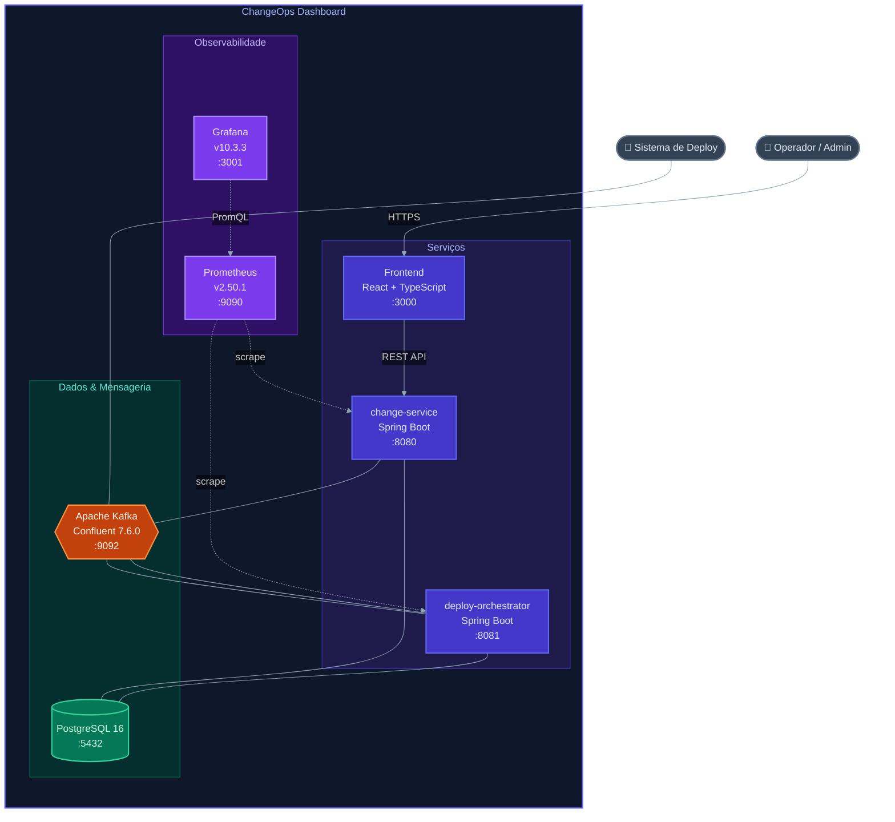
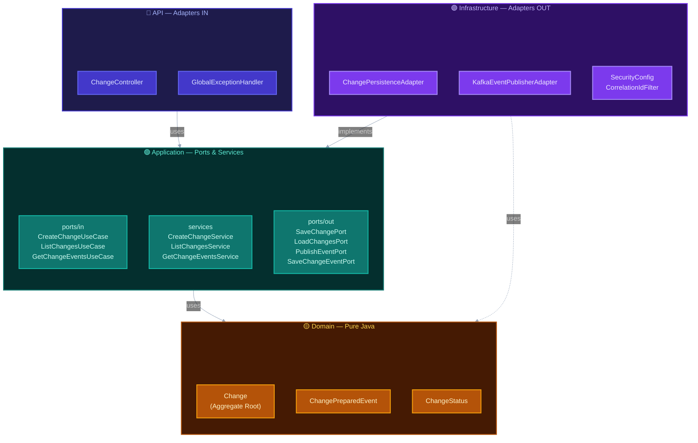
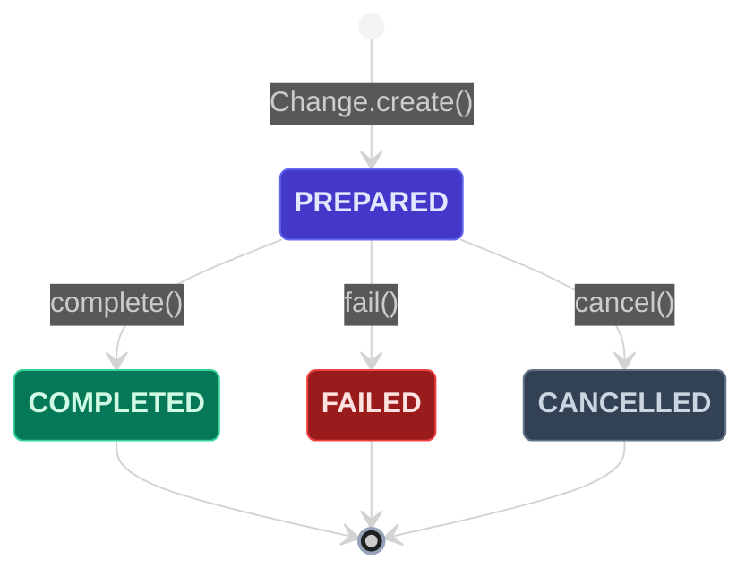
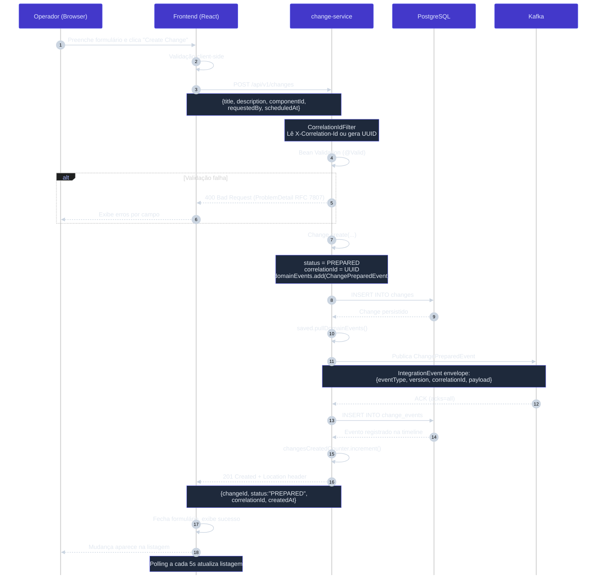
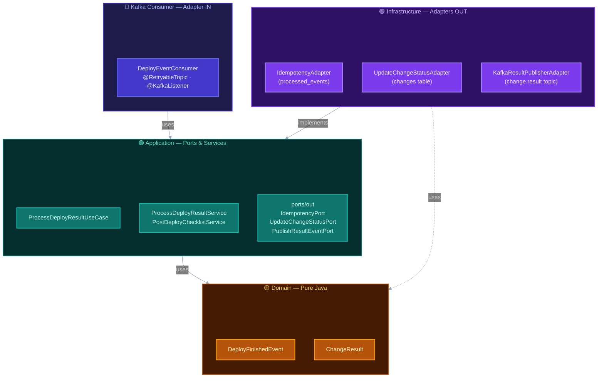
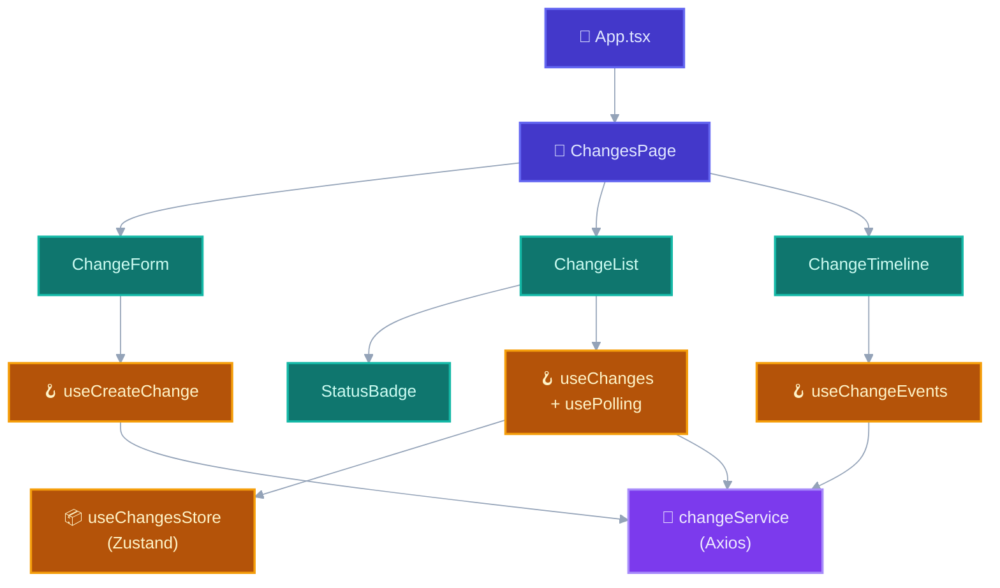
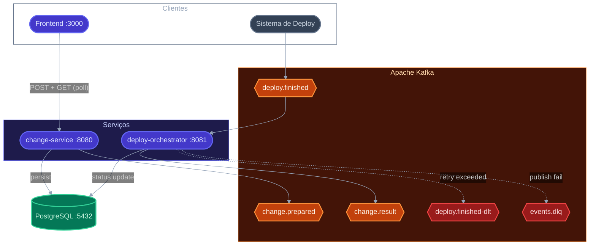
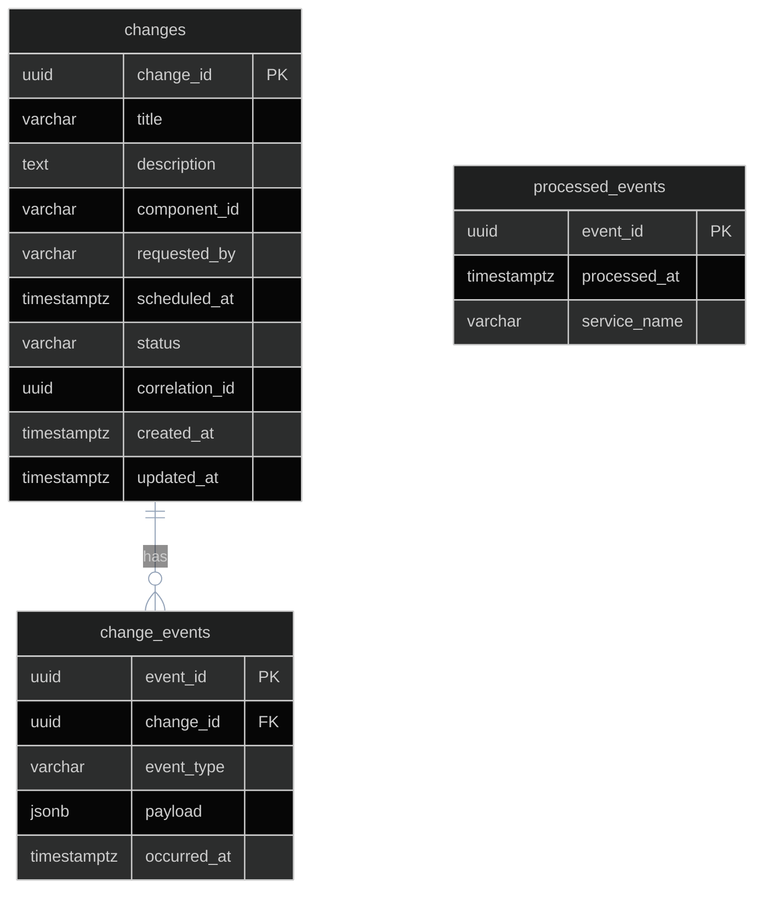
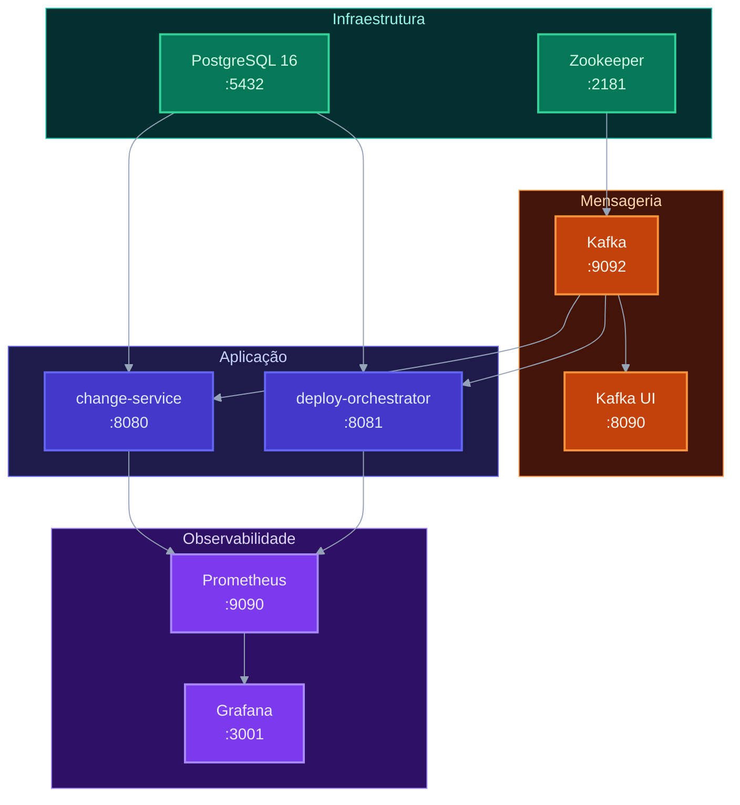

```mermaid
%%{init: {'theme':'dark','themeVariables':{'fontSize':'14px','actorTextColor':'#E0E7FF','actorBkg':'#4338CA','actorBorder':'#6366F1','activationBorderColor':'#6366F1','signalColor':'#CBD5E1','signalTextColor':'#E2E8F0','noteBkgColor':'#1E293B','noteBorderColor':'#6366F1','noteTextColor':'#E2E8F0','altSectionBkgColor':'#0F172A','labelTextColor':'#A5B4FC'},'sequence':{'mirrorActors':false,'messageFontSize':14,'noteFontSize':13,'actorFontSize':15,'noteMargin':12,'messageMargin':40,'width':220}}}%%
sequenceDiagram
    autonumber
    participant ES as Sistema de Deploy
    participant K as Kafka
    participant DO as deploy-orchestrator
    participant DB as PostgreSQL

    ES->>K: Publica DeployFinishedEvent
    Note over ES,K: topic: changeops.deploy.finished<br/>{deployId, changeId, result, executedAt}

    K->>DO: Consome evento via @KafkaListener

    Note over DO: MDC.put(correlation_id, change_id, deploy_id)

    DO->>DO: events_consumed_total.increment()

    DO->>DB: INSERT INTO processed_events (ON CONFLICT DO NOTHING)
    Note over DO,DB: IdempotencyPort.tryMarkAsProcessed()

    alt Evento já processado (retorno = 0)
        DO->>DO: log.warn("Event already processed")
        Note over DO: Descarta silenciosamente
    end

    DO->>DO: PostDeployChecklistService.execute()
    Note over DO: 4 checks: deploy-result-gate,<br/>healthcheck, smoke-test, error-rate

    alt Deploy SUCCESS + todos checks passam
        DO->>DB: UPDATE changes SET status='COMPLETED'
        DO->>DB: INSERT INTO change_events (ChangeCompletedEvent)
        DO->>K: Publica ChangeCompletedEvent
        Note over DO,K: topic: changeops.change.result
    else Deploy FAILURE ou check falha
        DO->>DB: UPDATE changes SET status='FAILED'
        DO->>DB: INSERT INTO change_events (ChangeFailedEvent)
        DO->>K: Publica ChangeFailedEvent
        Note over DO,K: topic: changeops.change.result
    end

    K-->>DO: ACK
    Note over DO: MDC.clear()

    rect rgb(69, 26, 26)
        Note over K,DO: Cenário de Falha — Retry + DLQ

        K->>DO: Consumo falha (exceção)
        DO->>DO: Retry 1 (500ms)
        DO->>DO: Retry 2 (1s)
        DO->>DO: Retry 3 (2s)
        DO->>DO: Retry 4 (4s)
        DO->>K: Envia para DLT
        Note over K: changeops.deploy.finished-dlt

        K->>DO: @KafkaListener(dlt) consome de DLT
        DO->>DO: log.error + events_failed_total.increment()
    end

    rect rgb(69, 26, 26)
        Note over DO,K: Falha na Publicação do Resultado

        DO->>K: kafkaTemplate.send() falha
        DO->>K: Fallback: envia para DLQ
        Note over K: changeops.events.dlq
        DO->>DO: log.error("Sending to DLQ")
    end
```

# ChangeOps Dashboard — Projeto Completo

> Gerado por: Arquiteto de Software Sênior  
> Stack: Java 17 + Spring Boot · React + TypeScript · Kafka · PostgreSQL · Docker Compose  
> Total de arquivos gerados: **102**

---

## Índice

1. [Repositório Backend — change-service](#1-repositório-backend--change-service)
2. [Repositório Backend — deploy-orchestrator](#2-repositório-backend--deploy-orchestrator)
3. [Repositório Frontend](#3-repositório-frontend)
4. [Contratos (OpenAPI + AsyncAPI)](#4-contratos)
5. [Modelo de Dados e Persistência](#5-modelo-de-dados-e-persistência)
6. [Segurança](#6-segurança)
7. [Observabilidade](#7-observabilidade)
8. [Automação (Docker Compose + Makefile + CI/CD)](#8-automação)
9. [Roadmap Técnico](#9-roadmap-técnico)

---

## Visão Arquitetural



| Container | Responsabilidade |
|-----------|-----------------|
| **Frontend** | Interface React com formulário de criação, listagem paginada, polling a cada 5s e timeline de eventos |
| **change-service** | API REST (`POST/GET /api/v1/changes`), validação de domínio, persistência, publicação de evento de domínio encapsulado em envelope de integração |
| **deploy-orchestrator** | Consumer Kafka com idempotência via `processed_events`, checklist pós-deploy, atualização de status, publicação de evento de resultado, retry com backoff + DLQ |
| **PostgreSQL** | Banco compartilhado com schema único: `changes`, `change_events`, `processed_events`. Flyway migrations independentes por serviço |
| **Kafka** | Broker de eventos com 3 tópicos principais + DLT. Produtor idempotente, consumer groups com ACK por registro |
| **Prometheus** | Scraper de métricas HTTP a cada 15s. Coleta: `changes_created_total`, `events_published_total`, `events_consumed_total`, `events_failed_total` |
| **Grafana** | 7 painéis: counters de criação/publicação/consumo/falha, latência p95, distribuição por status, taxa de eventos |

---

## 1. Repositório Backend — change-service

### Visão Geral

Serviço responsável pelo **Fluxo 1** completo: recebimento da requisição HTTP, validação de domínio (hexagonal), persistência e publicação do `ChangePreparedEvent` no Kafka com envelope de integração.

**Padrão arquitetural:** Hexagonal (Ports & Adapters)

```
change-service/
├── api/
│   ├── controller/       ChangeController, GlobalExceptionHandler
│   └── dto/              CreateChangeRequest/Response, ChangeDto, ChangeEventDto
├── application/
│   ├── port/in/          CreateChangeUseCase, ListChangesUseCase, GetChangeEventsUseCase
│   ├── port/out/         SaveChangePort, LoadChangesPort, PublishEventPort, SaveChangeEventPort
│   └── service/          CreateChangeService, ListChangesService, GetChangeEventsService
├── domain/
│   ├── model/            Change (Aggregate Root)
│   ├── event/            ChangePreparedEvent (domínio)
│   ├── exception/        ChangeNotFoundException, InvalidChangeStateException
│   └── valueobject/      ChangeStatus
└── infrastructure/
    ├── config/           KafkaConfig
    ├── kafka/            KafkaEventPublisherAdapter, IntegrationEvent (envelope)
    ├── observability/    CorrelationIdFilter (MDC)
    ├── persistence/      ChangePersistenceAdapter, ChangeEntity, ChangeEventEntity
    └── security/         SecurityConfig, CustomJwtAuthenticationConverter
```



### pom.xml

```xml
<?xml version="1.0" encoding="UTF-8"?>
<project xmlns="http://maven.apache.org/POM/4.0.0" ...>
  <parent>
    <groupId>org.springframework.boot</groupId>
    <artifactId>spring-boot-starter-parent</artifactId>
    <version>3.2.3</version>
  </parent>
  <groupId>com.changeops</groupId>
  <artifactId>change-service</artifactId>
  <version>1.0.0-SNAPSHOT</version>
  <properties>
    <java.version>17</java.version>
    <mapstruct.version>1.5.5.Final</mapstruct.version>
    <testcontainers.version>1.19.6</testcontainers.version>
  </properties>
  <!-- spring-boot-starter-web, validation, data-jpa, actuator, security -->
  <!-- spring-boot-starter-oauth2-resource-server -->
  <!-- spring-kafka, postgresql, flyway-core -->
  <!-- micrometer-registry-prometheus, logstash-logback-encoder:7.4 -->
  <!-- mapstruct, lombok, springdoc-openapi-starter-webmvc-ui:2.3.0 -->
  <!-- test: spring-boot-starter-test, spring-kafka-test, testcontainers -->
</project>
```

### Domínio

> **✅ Critérios atendidos:** `Arquitetura` · `Código`

#### [`Change`](../backend/change-service/src/main/java/com/changeops/changeservice/domain/model/Change.java) — Aggregate Root

> **✅ Critérios atendidos:** `Arquitetura` · `Código` · `Cenários`

```java
// domain/model/Change.java — zero imports de Spring/Kafka; objeto de domínio Java puro
@Getter
@Builder(access = AccessLevel.PRIVATE)
@AllArgsConstructor(access = AccessLevel.PRIVATE)
public class Change {
    private final UUID changeId;
    private final String title, description, componentId, requestedBy;
    private final Instant scheduledAt;
    private ChangeStatus status;          // MUTÁVEL: transições via complete()/fail()/cancel()
    private final UUID correlationId;     // UUID v4, gerado em Change.create()
    private final Instant createdAt;
    private Instant updatedAt;            // MUTÁVEL: atualizado por trigger + transições de domínio

    @Builder.Default
    private final List<DomainEvent> domainEvents = new ArrayList<>();  // Event sourcing

    // Factory method — única forma de criar um novo Change
    public static Change create(
            String title, String description,
            String componentId, String requestedBy, Instant scheduledAt) {

        UUID changeId     = UUID.randomUUID();
        UUID correlationId = UUID.randomUUID();
        Instant now       = Instant.now();

        Change change = Change.builder()
                .changeId(changeId).title(title).description(description)
                .componentId(componentId).requestedBy(requestedBy)
                .scheduledAt(scheduledAt).status(ChangeStatus.PREPARED)
                .correlationId(correlationId).createdAt(now).updatedAt(now)
                .build();

        // Dispara domain event — drenado pelo CreateChangeService.execute()
        change.domainEvents.add(new ChangePreparedEvent(
                changeId, componentId, requestedBy, scheduledAt, correlationId, now));
        return change;
    }

    // Caminho de reconstituição — usado pelo persistence adapter ao carregar do banco
    public static Change reconstitute(
            UUID changeId, String title, String description,
            String componentId, String requestedBy, Instant scheduledAt,
            ChangeStatus status, UUID correlationId,
            Instant createdAt, Instant updatedAt) {
        return Change.builder()
                .changeId(changeId).title(title).description(description)
                .componentId(componentId).requestedBy(requestedBy)
                .scheduledAt(scheduledAt).status(status)
                .correlationId(correlationId).createdAt(createdAt).updatedAt(updatedAt)
                .build();
    }

    public void complete() {
        if (this.status != ChangeStatus.PREPARED)
            throw new InvalidChangeStateException("Cannot complete change in status: " + this.status);
        this.status = ChangeStatus.COMPLETED;
        this.updatedAt = Instant.now();
    }

    public void fail() {
        if (this.status != ChangeStatus.PREPARED)
            throw new InvalidChangeStateException("Cannot fail change in status: " + this.status);
        this.status = ChangeStatus.FAILED;
        this.updatedAt = Instant.now();
    }

    public void cancel() {
        if (this.status != ChangeStatus.PREPARED)
            throw new InvalidChangeStateException("Cannot cancel change in status: " + this.status);
        this.status = ChangeStatus.CANCELLED;
        this.updatedAt = Instant.now();
    }

    // Drena a lista — eventos são publicados exatamente uma vez por ciclo de vida
    public List<DomainEvent> pullDomainEvents() {
        List<DomainEvent> events = Collections.unmodifiableList(new ArrayList<>(this.domainEvents));
        this.domainEvents.clear();
        return events;
    }
}
```

#### `ChangePreparedEvent` — Domain Event

> **✅ Critérios atendidos:** `Arquitetura` · `Código`

```java
// Implementa a interface marcadora DomainEvent; sem anotações Spring/Kafka
public record ChangePreparedEvent(
    UUID changeId, String componentId, String requestedBy,
    Instant scheduledAt, UUID correlationId, Instant occurredAt
) {}
```

#### `ChangeStatus` — Value Object

> **✅ Critérios atendidos:** `Código` · `Cenários`

```java
public enum ChangeStatus { DRAFT, PREPARED, COMPLETED, FAILED, CANCELLED }
```



### Application Layer — Use Cases

> **✅ Critérios atendidos:** `Arquitetura` · `Código`

```java
// port/in/CreateChangeUseCase.java
public interface CreateChangeUseCase {
    Result execute(Command command);
    record Command(String title, String description, String componentId,
                   String requestedBy, Instant scheduledAt) {}
    record Result(UUID changeId, String status, UUID correlationId, Instant createdAt) {}
}

// port/in/ListChangesUseCase.java
public interface ListChangesUseCase {
    Page<Result> execute(Query query, Pageable pageable);
    record Query(ChangeStatus status, String componentId) {}
    record Result(UUID changeId, String title, String componentId, String status,
                  UUID correlationId, Instant createdAt, Instant updatedAt) {}
}

// port/in/GetChangeEventsUseCase.java
public interface GetChangeEventsUseCase {
    List<Result> execute(UUID changeId);
    record Result(UUID eventId, UUID changeId, String eventType,
                  String payload, Instant occurredAt) {}
}
```

```java
// port/out/ interfaces
public interface SaveChangePort    { Change save(Change change); }
public interface LoadChangesPort   { Optional<Change> findById(UUID id);
                                     Page<Change> findAll(ChangeStatus, String, Pageable); }
public interface PublishEventPort  { void publish(Object domainEvent); }
public interface SaveChangeEventPort { void save(UUID changeId, String type,
                                                  String payload, Instant at); }
```

### CreateChangeService

> **✅ Critérios atendidos:** `Arquitetura` · `Código` · `Cenários` · `Observabilidade`

```java
@Slf4j @Service
public class CreateChangeService implements CreateChangeUseCase {

    @Override
    @Transactional
    public Result execute(Command command) {
        // 1. Factory method — gera changeId, correlationId, dispara ChangePreparedEvent
        Change change = Change.create(command.title(), command.description(),
                command.componentId(), command.requestedBy(), command.scheduledAt());

        Change saved = saveChangePort.save(change);

        // 2. Drena domain events, publica no Kafka, persiste na timeline
        saved.pullDomainEvents().forEach(event -> {
            publishEventPort.publish(event);                          // → KafkaEventPublisherAdapter
            saveChangeEventPort.save(                                 // → registro na change_events
                saved.getChangeId(),
                event.getClass().getSimpleName(),
                toJson(event),
                Instant.now());
        });

        changesCreatedCounter.increment();            // Prometheus
        log.info("Change created: changeId={}, correlationId={}",
                 saved.getChangeId(), saved.getCorrelationId());

        return new Result(saved.getChangeId(), saved.getStatus().name(),
                          saved.getCorrelationId(), saved.getCreatedAt());
    }
}
```

### Infrastructure — Kafka

> **✅ Critérios atendidos:** `Arquitetura` · `Cenários`

#### [`IntegrationEvent`](../backend/change-service/src/main/java/com/changeops/changeservice/infrastructure/kafka/IntegrationEvent.java) — Envelope externo

> **✅ Critérios atendidos:** `Arquitetura` · `Cenários` · `Comunicação`

```java
// Envolve todo domain event antes de publicar no Kafka (ADR-003)
@Getter
@Builder
@NoArgsConstructor
@AllArgsConstructor
public class IntegrationEvent {
    private String  eventType;    // ex: "ChangePreparedEvent"
    private String  version;      // "1.0" — versionamento por tolerant reader
    private UUID    correlationId; // UUID de rastreamento ponta a ponta
    private Instant occurredAt;
    private Object  payload;       // DTO específico do domínio (não o domain event em si)
}
```

#### `KafkaEventPublisherAdapter`

> **✅ Critérios atendidos:** `Arquitetura` · `Cenários` · `Observabilidade`

```java
@Component
public class KafkaEventPublisherAdapter implements PublishEventPort {

    @Override
    public void publish(Object domainEvent) {
        if (domainEvent instanceof ChangePreparedEvent event) {
            IntegrationEvent envelope = IntegrationEvent.builder()
                .eventType("ChangePreparedEvent").version("1.0")
                .correlationId(event.correlationId())
                .occurredAt(Instant.now())
                .payload(new ChangePreparedPayload(event.changeId(),
                         event.componentId(), event.requestedBy(), event.scheduledAt()))
                .build();

        try {
            // Síncrono com timeout de 10s — acks=all, produtor idempotente
            CompletableFuture<SendResult<String, IntegrationEvent>> future =
                    kafkaTemplate.send(changePreparedTopic, key, envelope);
            future.get(10, TimeUnit.SECONDS);
            eventsPublishedCounter.increment();
            log.info("ChangePreparedEvent published: changeId={}, correlationId={}",
                    event.changeId(), event.correlationId());
        } catch (ExecutionException | InterruptedException | TimeoutException ex) {
            log.error("Failed to publish ChangePreparedEvent: changeId={}, correlationId={}",
                    event.changeId(), event.correlationId(), ex);
            throw new RuntimeException("Kafka publish failed", ex);
        }
    }
}
```

#### [`KafkaConfig`](../backend/change-service/src/main/java/com/changeops/changeservice/infrastructure/config/KafkaConfig.java) — Producer idempotente

> **✅ Critérios atendidos:** `Arquitetura` · `Cenários`

```java
@Configuration
public class KafkaConfig {

    @Bean
    public ProducerFactory<String, IntegrationEvent> producerFactory() {
        Map<String, Object> props = new HashMap<>();
        props.put(ProducerConfig.BOOTSTRAP_SERVERS_CONFIG, bootstrapServers);
        props.put(ProducerConfig.ACKS_CONFIG, "all");                     // Durabilidade máxima
        props.put(ProducerConfig.RETRIES_CONFIG, 3);                      // Retry automático
        props.put(ProducerConfig.ENABLE_IDEMPOTENCE_CONFIG, true);        // Exactly-once na produção
        props.put(ProducerConfig.MAX_IN_FLIGHT_REQUESTS_PER_CONNECTION, 1); // Ordem garantida
        JsonSerializer<IntegrationEvent> valueSerializer = new JsonSerializer<>(objectMapper);
        valueSerializer.setAddTypeInfo(false);  // Sem @class no JSON
        return new DefaultKafkaProducerFactory<>(props, new StringSerializer(), valueSerializer);
    }

    @Bean
    public KafkaTemplate<String, IntegrationEvent> kafkaTemplate() {
        return new KafkaTemplate<>(producerFactory());
    }

    @Bean
    public NewTopic changePreparedTopic() {
        // 3 partições: key=changeId distribui uniformemente; replica factor via env var
        return TopicBuilder.name(changePreparedTopic)
                .partitions(3)
                .replicas(replicationFactor)   // ${KAFKA_REPLICATION_FACTOR:1}
                .build();
    }
}
```

### Infrastructure — Persistência

> **✅ Critérios atendidos:** `Arquitetura` · `Código`

#### [`ChangePersistenceAdapter`](../backend/change-service/src/main/java/com/changeops/changeservice/infrastructure/persistence/ChangePersistenceAdapter.java)

> **✅ Critérios atendidos:** `Arquitetura` · `Código`

```java
@Component
public class ChangePersistenceAdapter
        implements SaveChangePort, LoadChangesPort, SaveChangeEventPort {

    @Override
    public Change save(Change change) {
        return toDomain(changeJpaRepository.save(toEntity(change)));
    }

    @Override
    public Page<Change> findAll(ChangeStatus status, String componentId, Pageable p) {
        return changeJpaRepository.findAllFiltered(status, componentId, p)
                                  .map(this::toDomain);
    }

    @Override
    public void save(UUID changeId, String type, String payload, Instant at) {
        changeEventJpaRepository.save(ChangeEventEntity.builder()
            .eventId(UUID.randomUUID()).changeId(changeId)
            .eventType(type).payload(payload).occurredAt(at).build());
    }
}
```

#### `ChangeJpaRepository`

> **✅ Critérios atendidos:** `Código` · `Segurança`

```java
public interface ChangeJpaRepository extends JpaRepository<ChangeEntity, UUID> {
    @Query("""
        SELECT c FROM ChangeEntity c
        WHERE (:status IS NULL OR c.status = :status)
          AND (:componentId IS NULL OR c.componentId = :componentId)
        ORDER BY c.createdAt DESC
        """)
    Page<ChangeEntity> findAllFiltered(
        @Param("status") ChangeStatus status,
        @Param("componentId") String componentId,
        Pageable pageable);
}
```

### API Layer

> **✅ Critérios atendidos:** `Cenários` · `Segurança`

#### [`ChangeController`](../backend/change-service/src/main/java/com/changeops/changeservice/api/controller/ChangeController.java)

> **✅ Critérios atendidos:** `Cenários` · `Código` · `Segurança`

```java
@RestController
@RequestMapping("/api/v1/changes")
public class ChangeController {

    @PostMapping
    public ResponseEntity<CreateChangeResponse> create(
            @Valid @RequestBody CreateChangeRequest request,
            @RequestHeader(value = "X-User-Id", required = false) String userId,
            @AuthenticationPrincipal Jwt jwt) {

        CreateChangeUseCase.Result result = createChangeUseCase.execute(
            new CreateChangeUseCase.Command(
                request.title(), request.description(), request.componentId(),
                resolveRequestedBy(userId, jwt, request.requestedBy()),
                request.scheduledAt()));

        URI location = ServletUriComponentsBuilder.fromCurrentRequest()
            .path("/{id}").buildAndExpand(result.changeId()).toUri();

        return ResponseEntity.created(location)
            .body(new CreateChangeResponse(result.changeId(), result.status(),
                                           result.correlationId(), result.createdAt()));
    }

    @GetMapping
    public ResponseEntity<Page<ChangeDto>> list(
            @RequestParam(required = false) ChangeStatus status,
            @RequestParam(required = false) String componentId,
            @PageableDefault(size = 20, sort = "createdAt") Pageable pageable) { ... }

    @GetMapping("/{changeId}/events")
    public ResponseEntity<List<ChangeEventDto>> getEvents(@PathVariable UUID changeId) { ... }
}
```

#### `CreateChangeRequest` — Validações

> **✅ Critérios atendidos:** `Segurança` · `Código` · `Comunicação`

```java
public record CreateChangeRequest(
    @NotBlank(message = "title is required")
    @Size(max = 255)
    String title,

    @Size(max = 2000)
    String description,

    @NotBlank(message = "componentId is required")
    @Size(max = 100, message = "componentId must not exceed 100 characters")
    @Pattern(regexp = "^[a-zA-Z0-9][a-zA-Z0-9_.\\-]{0,99}$",
            message = "componentId must start with alphanumeric and contain only letters, digits, dots, hyphens, or underscores")
    String componentId,

    @NotBlank(message = "requestedBy is required")
    String requestedBy,

    @NotNull(message = "scheduledAt is required")
    @Future(message = "scheduledAt must be a future date")
    Instant scheduledAt
) {}
```

#### `GlobalExceptionHandler` — RFC 7807 Problem Details

> **✅ Critérios atendidos:** `Comunicação` · `Código`

```java
@RestControllerAdvice
public class GlobalExceptionHandler {

    @ExceptionHandler(MethodArgumentNotValidException.class)
    public ProblemDetail handleValidation(MethodArgumentNotValidException ex) {
        Map<String, String> fields = ex.getBindingResult().getFieldErrors().stream()
            .collect(toMap(FieldError::getField, FieldError::getDefaultMessage));
        ProblemDetail pd = ProblemDetail.forStatusAndDetail(BAD_REQUEST, "Validation failed");
        pd.setProperty("fields", fields);
        return pd;
    }

    @ExceptionHandler(ChangeNotFoundException.class)
    public ProblemDetail handleNotFound(ChangeNotFoundException ex) { ... }
}
```

### Segurança

> **✅ Critérios atendidos:** `Segurança` · `Arquitetura`

```java
@Configuration @EnableWebSecurity
public class SecurityConfig {

    @Bean
    public SecurityFilterChain filterChain(HttpSecurity http) throws Exception {
        return http
            .csrf(AbstractHttpConfigurer::disable)
            .cors(cors -> cors.configurationSource(corsConfigurationSource()))
            .sessionManagement(s -> s.sessionCreationPolicy(STATELESS))
            .authorizeHttpRequests(auth -> auth
                .requestMatchers("/actuator/health", "/actuator/prometheus").permitAll()
                .requestMatchers("/swagger-ui/**", "/v3/api-docs/**").permitAll()
                .requestMatchers(HttpMethod.GET, "/api/v1/changes/**").hasAnyRole("OPERATOR","ADMIN")
                .requestMatchers(HttpMethod.POST, "/api/v1/changes").hasAnyRole("OPERATOR","ADMIN")
                .anyRequest().authenticated())
            .oauth2ResourceServer(oauth2 -> oauth2.jwt(
                jwt -> jwt.jwtAuthenticationConverter(new CustomJwtAuthenticationConverter())))
            .build();
    }
}
```

### Observabilidade — CorrelationIdFilter

> **✅ Critérios atendidos:** `Observabilidade` · `Cenários`

```java
@Component @Order(1)
public class CorrelationIdFilter implements Filter {
    @Override
    public void doFilter(ServletRequest req, ServletResponse res, FilterChain chain) {
        String correlationId = httpRequest.getHeader("X-Correlation-Id");
        if (correlationId == null) correlationId = UUID.randomUUID().toString();
        MDC.put("correlation_id", correlationId);
        MDC.put("service", "change-service");
        httpResponse.setHeader("X-Correlation-Id", correlationId);
        try { chain.doFilter(req, res); } finally { MDC.clear(); }
    }
}
```

### application.yml

> **✅ Critérios atendidos:** `Arquitetura` · `Segurança` · `Observabilidade`

```yaml
spring:
  application:
    name: change-service
  datasource:
    url: jdbc:postgresql://${DB_HOST:localhost}:${DB_PORT:5432}/${DB_NAME:changeops}
    username: ${DB_USER:changeops}
    password: ${DB_PASS:changeops}
  jpa:
    hibernate.ddl-auto: validate
  flyway:
    enabled: true
    locations: classpath:db/migration
  kafka:
    bootstrap-servers: ${KAFKA_BOOTSTRAP_SERVERS:localhost:9092}
  security.oauth2.resourceserver.jwt:
    issuer-uri: ${JWT_ISSUER_URI:http://localhost:8180/realms/changeops}

server.port: ${SERVER_PORT:8080}

management:
  endpoints.web.exposure.include: health,info,prometheus,metrics
  metrics.tags.application: ${spring.application.name}

changeops.kafka.topics.change-prepared: changeops.change.prepared
```

### Testes

> **✅ Critérios atendidos:** `Testes`

#### [`ChangeTest`](../backend/change-service/src/test/java/com/changeops/changeservice/domain/model/ChangeTest.java) — Unitário (domínio)

> **✅ Critérios atendidos:** `Testes` · `Código`

```java
class ChangeTest {
    @Test void create_shouldSetPreparedStatus_andGenerateCorrelationId() { ... }
    @Test void create_shouldRaiseDomainEvent() { ... }
    @Test void pullDomainEvents_shouldClearEventsAfterPull() { ... }
    @Test void complete_shouldTransitionToCompleted_whenPrepared() { ... }
    @Test void fail_shouldThrow_whenAlreadyFailed() { ... }
}
```

#### `CreateChangeIT` — Integração (Testcontainers)

> **✅ Critérios atendidos:** `Testes` · `Cenários`

```java
@SpringBootTest(webEnvironment = RANDOM_PORT)
@Testcontainers @ActiveProfiles("test")
class CreateChangeIT {
    @Container static PostgreSQLContainer<?> postgres = ...;
    @Container static KafkaContainer kafka = ...;

    @Test void shouldCreate_whenPayloadIsValid_thenReturn201AndPublishEvent() { ... }
    @Test void shouldReturn400_whenTitleIsMissing() { ... }
    @Test void shouldReturn400_whenComponentIdIsMissing() { ... }
    @Test void shouldReturn400_whenComponentIdHasInvalidFormat() { ... }
    @Test void shouldListChanges_andReturnPaginatedResults() { ... }
}
```

### Fluxo 1 — Sequência: Criação de Mudança

> **✅ Critérios atendidos:** `Comunicação` · `Arquitetura` · `Cenários`



---

## 2. Repositório Backend — deploy-orchestrator

### Visão Geral

> **✅ Critérios atendidos:** `Arquitetura` · `Comunicação`

Serviço responsável pelo **Fluxo 2** completo: consumo do `DeployFinishedEvent`, garantia de idempotência, checklist pós-deploy, atualização de status e publicação de `ChangeCompletedEvent` / `ChangeFailedEvent` com retry exponencial e DLQ.

```
deploy-orchestrator/
├── application/
│   ├── port/in/   ProcessDeployResultUseCase
│   ├── port/out/  IdempotencyPort, UpdateChangeStatusPort, PublishResultEventPort
│   └── service/   ProcessDeployResultService, PostDeployChecklistService
├── domain/
│   ├── event/     DeployFinishedEvent (consumed)
│   ├── model/     ChangeResult
│   └── exception/ InvalidOrchestratorStateException
└── infrastructure/
    ├── kafka/     DeployEventConsumer, KafkaResultPublisherAdapter,
    │              KafkaConfig, IntegrationEvent
    └── persistence/ IdempotencyAdapter, UpdateChangeStatusAdapter,
                     ProcessedEventEntity/Repository, ChangeStatusEntity/Repository
```



### `DeployFinishedEvent` — Consumed

> **✅ Critérios atendidos:** `Arquitetura` · `Cenários`

```java
public record DeployFinishedEvent(
    String eventType, String version, UUID correlationId, Instant occurredAt,
    Payload payload
) {
    public record Payload(UUID deployId, UUID changeId, String result, Instant executedAt) {}
    public boolean isSuccess() { return "SUCCESS".equalsIgnoreCase(payload().result()); }
}
```

### `ProcessDeployResultService` — Orquestração

> **✅ Critérios atendidos:** `Arquitetura` · `Código` · `Cenários` · `Observabilidade`

```java
@Slf4j @Service
public class ProcessDeployResultService implements ProcessDeployResultUseCase {

    @Override
    @Transactional
    public void execute(DeployFinishedEvent event) {
        var payload = event.payload();
        MDC.put("correlation_id", event.correlationId().toString());
        MDC.put("change_id",  payload.changeId().toString());
        MDC.put("deploy_id",  payload.deployId().toString());

        try {
            // 1. Verificação de idempotência
            if (idempotencyPort.isAlreadyProcessed(payload.deployId())) {
                log.warn("Event already processed, discarding: deployId={}", payload.deployId());
                return;
            }

            // 2. Checklist pós-deploy
            ChecklistResult checklist = checklistService.execute(
                payload.changeId(), payload.deployId(), event.isSuccess());

            // 3. Construir resultado
            ChangeResult result = ChangeResult.from(payload.changeId(), payload.deployId(),
                event.correlationId(), event.isSuccess() && checklist.allPassed());

            // 4. Atualizar status da change
            if (result.isSuccess()) updateChangeStatusPort.markCompleted(payload.changeId());
            else                    updateChangeStatusPort.markFailed(payload.changeId());

            // 5. Marcar evento como processado (store de idempotência)
            idempotencyPort.markAsProcessed(payload.deployId(), "deploy-orchestrator");

            // 6. Publicar evento de resultado
            result.markFinished();
            publishResultEventPort.publish(result);

        } finally {
            MDC.remove("deploy_id"); MDC.remove("change_id");
        }
    }
}
```

### `DeployEventConsumer` — Kafka com Retry + DLQ

> **✅ Critérios atendidos:** `Arquitetura` · `Cenários` · `Código`

```java
@Component
public class DeployEventConsumer {

    @RetryableTopic(
        attempts = "4",
        backoff = @Backoff(delay = 500, multiplier = 2.0, maxDelay = 10_000),
        autoCreateTopics = "true",
        dltStrategy = DltStrategy.FAIL_ON_ERROR,
        dltTopicSuffix = "-dlt"
    )
    @KafkaListener(
        topics = "${changeops.kafka.topics.deploy-finished}",
        groupId = "${changeops.kafka.consumer.group-id}",
        containerFactory = "deployEventListenerContainerFactory"
    )
    public void onDeployFinished(ConsumerRecord<String, DeployFinishedEvent> record, ...) {
        processDeployResultUseCase.execute(record.value());
    }

    @KafkaListener(topics = "${changeops.kafka.topics.deploy-finished}-dlt", ...)
    public void onDlt(ConsumerRecord<String, DeployFinishedEvent> record) {
        DeployFinishedEvent event = record.value();
        try {
            if (event != null && event.payload() != null) {
                MDC.put("correlation_id", event.correlationId() != null
                        ? event.correlationId().toString() : "unknown");
                MDC.put("change_id", event.payload().changeId() != null
                        ? event.payload().changeId().toString() : "unknown");
                MDC.put("deploy_id", event.payload().deployId() != null
                        ? event.payload().deployId().toString() : "unknown");
                log.error("Event sent to DLQ after max retries: key={}, deployId={}, changeId={}, result={}",
                        record.key(), event.payload().deployId(),
                        event.payload().changeId(), event.payload().result());
            } else {
                log.error("Event sent to DLQ after max retries: key={}, payload=null", record.key());
            }
            consumeErrorCounter.increment();
        } finally {
            MDC.remove("correlation_id");
            MDC.remove("change_id");
            MDC.remove("deploy_id");
        }
    }
}
```

### `IdempotencyAdapter`

> **✅ Critérios atendidos:** `Arquitetura` · `Cenários` · `Observabilidade`

```java
@Component
public class IdempotencyAdapter implements IdempotencyPort {

    private final ProcessedEventRepository repository;

    // Verificação nível 1 — leitura rápida antes de qualquer processamento
    @Override
    public boolean isAlreadyProcessed(UUID eventId) {
        return repository.existsById(eventId);
    }

    // Nível 2 — escrita segura com proteção contra race condition
    @Override
    public void markAsProcessed(UUID eventId, String serviceName) {
        try {
            repository.save(ProcessedEventEntity.builder()
                .eventId(eventId).processedAt(Instant.now())
                .serviceName(serviceName).build());
        } catch (DataIntegrityViolationException e) {
            // Race condition: another instance already processed — safe to ignore
            log.warn("Concurrent idempotency conflict for eventId={}", eventId);
        }
    }

    // Insert atômico (INSERT … ON CONFLICT DO NOTHING) — retorna false se duplicado
    @Override
    @Transactional
    public boolean tryMarkAsProcessed(UUID eventId, String serviceName) {
        UUID req = Objects.requireNonNull(eventId, "eventId must not be null");
        String svc = Objects.requireNonNull(serviceName, "serviceName must not be null");
        int inserted = repository.insertIfAbsent(req, svc);
        if (inserted == 0) {
            log.debug("Event already processed (atomic check): eventId={}", req);
            return false;
        }
        log.debug("Event atomically marked as processed: eventId={}", req);
        return true;
    }
}
```

### [`KafkaConfig`](../backend/deploy-orchestrator/src/main/java/com/changeops/deployorchestrator/infrastructure/kafka/KafkaConfig.java) — Consumer + Producer

> **✅ Critérios atendidos:** `Arquitetura` · `Cenários`

```java
@Configuration
public class KafkaConfig {

    // ── Consumer ──────────────────────────────────────────────────────────────

    @Bean
    public ConsumerFactory<String, DeployFinishedEvent> deployEventConsumerFactory() {
        Map<String, Object> props = new HashMap<>();
        props.put(ConsumerConfig.BOOTSTRAP_SERVERS_CONFIG, bootstrapServers);
        props.put(ConsumerConfig.GROUP_ID_CONFIG, groupId);
        props.put(ConsumerConfig.AUTO_OFFSET_RESET_CONFIG, "earliest");
        props.put(ConsumerConfig.ENABLE_AUTO_COMMIT_CONFIG, false);
        JsonDeserializer<DeployFinishedEvent> valueDeserializer =
                new JsonDeserializer<>(DeployFinishedEvent.class, objectMapper, false);
        valueDeserializer.addTrustedPackages("com.changeops.*");
        return new DefaultKafkaConsumerFactory<>(props, new StringDeserializer(), valueDeserializer);
    }

    @Bean
    public ConcurrentKafkaListenerContainerFactory<String, DeployFinishedEvent>
    deployEventListenerContainerFactory() {
        ConcurrentKafkaListenerContainerFactory<String, DeployFinishedEvent> factory =
                new ConcurrentKafkaListenerContainerFactory<>();
        factory.setConsumerFactory(deployEventConsumerFactory());
        factory.getContainerProperties().setAckMode(ContainerProperties.AckMode.RECORD);
        factory.setConcurrency(3); // 3 threads para 3 partições
        return factory;
    }

    // ── Producer ──────────────────────────────────────────────────────────────

    @Bean
    public ProducerFactory<String, IntegrationEvent> resultProducerFactory() {
        Map<String, Object> props = new HashMap<>();
        props.put(ProducerConfig.BOOTSTRAP_SERVERS_CONFIG, bootstrapServers);
        props.put(ProducerConfig.ACKS_CONFIG, "all");
        props.put(ProducerConfig.RETRIES_CONFIG, 3);
        props.put(ProducerConfig.ENABLE_IDEMPOTENCE_CONFIG, true);
        JsonSerializer<IntegrationEvent> valueSerializer = new JsonSerializer<>(objectMapper);
        valueSerializer.setAddTypeInfo(false); // JSON limpo, sem Spring type headers
        return new DefaultKafkaProducerFactory<>(props, new StringSerializer(), valueSerializer);
    }

    @Bean
    public KafkaTemplate<String, IntegrationEvent> resultKafkaTemplate() {
        return new KafkaTemplate<>(resultProducerFactory());
    }

    // ── Topics ────────────────────────────────────────────────────────────────

    @Bean public NewTopic deployFinishedTopic() {
        return TopicBuilder.name(deployFinishedTopic).partitions(3).replicas(replicationFactor).build();
    }
    @Bean public NewTopic changeResultTopic() {
        return TopicBuilder.name(changeResultTopic).partitions(3).replicas(replicationFactor).build();
    }
    @Bean public NewTopic changeResultDltTopic() {
        return TopicBuilder.name(changeResultTopic + "-dlt").partitions(1).replicas(replicationFactor).build();
    }
}
```

### `application.yml` — [`deploy-orchestrator`](../backend/deploy-orchestrator/src/main/resources/application.yml)

> **✅ Critérios atendidos:** `Arquitetura` · `Observabilidade`

```yaml
spring:
  application:
    name: deploy-orchestrator
  datasource:
    url: jdbc:postgresql://${DB_HOST:localhost}:${DB_PORT:5432}/${DB_NAME:changeops}
    username: ${DB_USER:changeops}
    password: ${DB_PASS:changeops}
  flyway:
    enabled: true
    locations: classpath:db/migration
    # Tabela de histórico separada — evita conflitos com migrations do change-service
    table: flyway_schema_history_orchestrator
    # baseline-on-migrate: schema já populado pelo change-service na inicialização
    baseline-on-migrate: true
    baseline-version: 1
  kafka:
    bootstrap-servers: ${KAFKA_BOOTSTRAP_SERVERS:localhost:9092}
    consumer:
      properties:
        spring.json.trusted.packages: com.changeops.*

changeops:
  kafka:
    consumer:
      group-id: ${KAFKA_GROUP_ID:deploy-orchestrator-group}
    topics:
      deploy-finished: ${KAFKA_TOPIC_DEPLOY_FINISHED:changeops.deploy.finished}
      change-result:   ${KAFKA_TOPIC_CHANGE_RESULT:changeops.change.result}

management:
  metrics:
    distribution:
      percentiles-histogram:
        spring.kafka.listener: true
    export:
      prometheus:
        enabled: true
        step: 5s
    tags:
      application: deploy-orchestrator
```

### Testes — [`deploy-orchestrator`](../backend/deploy-orchestrator/src/test/java/com/changeops/deployorchestrator/)

> **✅ Critérios atendidos:** `Testes` · `Cenários`

```java
// ProcessDeployResultServiceTest.java
class ProcessDeployResultServiceTest {
    @Test void shouldMarkCompleted_andPublishEvent_whenDeploySucceeds() { ... }
    @Test void shouldMarkFailed_andPublishEvent_whenDeployFails() { ... }
    @Test void shouldDiscardEvent_whenDeployIdAlreadyProcessed() { ... }
    @Test void shouldNotMarkCompleted_whenSameEventDeliveredTwice() { ... }
}

// DeployEventConsumerIT.java — Testcontainers (Kafka 7.6.0 + PostgreSQL 16)
@SpringBootTest
@EmbeddedKafka
class DeployEventConsumerIT {
    @Test void fullFlow_success(); // Kafka → DB COMPLETED + change.result publicado
    @Test void fullFlow_failure(); // Kafka → DB FAILED
    @Test void idempotency_sameEventTwice_stateUnchanged();
}

// IdempotencyIntegrationTest.java — Testcontainers (PostgreSQL 16)
class IdempotencyIntegrationTest {
    @Test void tryMarkAsProcessed_returnsTrueFirstTime();
    @Test void tryMarkAsProcessed_returnsFalseOnDuplicate();
    @Test void concurrent_insertions_onlyOneSucceeds(); // simula race condition
}
```

### [`PostDeployChecklistService`](../backend/deploy-orchestrator/src/main/java/com/changeops/deployorchestrator/application/service/PostDeployChecklistService.java) — Simulado / Extensível

> **✅ Critérios atendidos:** `Cenários` · `Evolução`

```java
@Service
public class PostDeployChecklistService {
    public ChecklistResult execute(UUID changeId, UUID deployId, boolean deploySucceeded) {
        List<CheckItem> items = List.of(
            check("deploy-result-gate",    deploySucceeded, "Deploy result was FAILURE"),
            check("healthcheck",           deploySucceeded, "Service did not become healthy"),
            check("smoke-test",            deploySucceeded, "Smoke test failed post-deploy"),
            check("error-rate-threshold",  deploySucceeded, "Error rate exceeded threshold")
        );
        // Extensão: chamar health endpoints reais, queries no Prometheus, test runners externos
        return new ChecklistResult(items.stream().allMatch(CheckItem::passed), ...);
    }
}
```

### Testes

```java
class ProcessDeployResultServiceTest {
    @Test void shouldMarkCompleted_andPublishEvent_whenDeploySucceeds() { ... }
    @Test void shouldMarkFailed_andPublishEvent_whenDeployFails() { ... }
    @Test void shouldDiscardEvent_whenDeployIdAlreadyProcessed() { ... }
    @Test void shouldNotMarkCompleted_whenSameEventDeliveredTwice() { ... }
}
```

### Fluxo 2 — Sequência: Orquestração de Deploy

> **✅ Critérios atendidos:** `Comunicação` · `Arquitetura` · `Cenários`



---

## 3. Repositório Frontend

### Stack

- **React 18** + **TypeScript 5**
- **Vite** (build + dev server)
- **Zustand** (estado global)
- **@tanstack/react-query v5** (server-state caching, invalidação automática, background refresh)
- **Axios** (HTTP client com interceptors)
- **date-fns** (formatação de datas)
- **Vitest** + **Testing Library** (testes)

### Estrutura

```
frontend/src/
├── features/changes/
│   ├── types/       index.ts  (Change, ChangeEvent, PageResponse, ApiError)
│   ├── services/    changeService.ts  (create, list, getEvents)
│   ├── store/       useChangesStore.ts  (Zustand)
│   ├── hooks/       useChanges.ts, useCreateChange.ts, useChangeEvents.ts
│   └── components/  ChangeForm, ChangeList, ChangeTimeline
├── shared/
│   ├── components/  StatusBadge
│   ├── hooks/       usePolling.ts
│   └── lib/         http.ts (axios), test-setup.ts
└── app/
    └── routes/      ChangesPage.tsx (main page)
```



### [`http.ts`](../frontend/src/shared/lib/http.ts) — Axios Client

> **✅ Critérios atendidos:** `Segurança` · `Código`

```typescript
export const http = axios.create({
  baseURL: import.meta.env.VITE_API_BASE_URL ?? '/api/v1',
  headers: { 'Content-Type': 'application/json' },
  timeout: 10_000,
})

// NOTA DE SEGURANÇA: auth via localStorage é placeholder da POC.
// Em produção, substituir por cookie httpOnly via fluxo OAuth2 PKCE (ROADMAP § 2.2).
http.interceptors.request.use((config) => {
  const token = localStorage.getItem('access_token')
  if (token) config.headers.Authorization = `Bearer ${token}`
  const userId = localStorage.getItem('user_id') ?? 'dev-user-001'
  config.headers['X-User-Id'] = userId  // fallback apenas para dev (perfil local)
  return config
})

// Normaliza erros no formato RFC 7807 ApiError
http.interceptors.response.use(
  (res) => res,
  (err: AxiosError) => {
    const data = err.response?.data as Partial<ApiError> | undefined
    const apiError: ApiError = {
      title:     data?.title  ?? 'Unexpected Error',
      detail:    data?.detail ?? err.message,
      status:    err.response?.status ?? 0,
      fields:    data?.fields,
      timestamp: data?.timestamp ?? new Date().toISOString(),
    }
    return Promise.reject(apiError)
  },
)
```

### [`changeService.ts`](../frontend/src/features/changes/services/changeService.ts)

> **✅ Critérios atendidos:** `Código` · `Cenários`

```typescript
const changeService = {
  async create(payload: CreateChangePayload): Promise<CreateChangeResponse> {
    const { data } = await http.post<CreateChangeResponse>('/changes', payload)
    return data
  },
  async list(params: ListChangesParams = {}): Promise<PageResponse<Change>> {
    const { data } = await http.get<PageResponse<Change>>('/changes', { params })
    return data
  },
  async getEvents(changeId: string): Promise<ChangeEvent[]> {
    const { data } = await http.get<ChangeEvent[]>(`/changes/${changeId}/events`)
    return data
  },
}
```

### `useChangesStore.ts` — Zustand

> **✅ Critérios atendidos:** `Código`

```typescript
export const useChangesStore = create<ChangesState>((set) => ({
  page: null,
  selectedChangeId: null,
  isPolling: false,
  setPage: (page) => set({ page }),
  setSelectedChangeId: (id) => set({ selectedChangeId: id }),
  upsertChange: (change) => set((state) => {
    if (!state.page) return {}
    const content = state.page.content.map(c =>
      c.changeId === change.changeId ? change : c)
    return { page: { ...state.page, content } }
  }),
}))
```

### `usePolling.ts`

> **✅ Critérios atendidos:** `Código` · `Cenários`

```typescript
export function usePolling(
  callback: () => void | Promise<void>,
  { interval = 5_000, enabled = true }: UsePollingOptions = {}
) {
  const savedCallback = useRef(callback)
  const timerRef = useRef<ReturnType<typeof setTimeout> | null>(null)

  // Keep ref in sync without recreating the effect
  useEffect(() => { savedCallback.current = callback }, [callback])

  const stop = useCallback(() => {
    if (timerRef.current) clearTimeout(timerRef.current)
  }, [])

  useEffect(() => {
    if (!enabled) return
    const tick = async () => {
      try   { await savedCallback.current() }
      finally { timerRef.current = setTimeout(tick, interval) } // auto-reagendamento
    }
    timerRef.current = setTimeout(tick, interval)
    return stop // limpeza ao desmontar / mudança de dependência
  }, [enabled, interval, stop])

  return { stop }
}
```

### `useChanges.ts` — Lista com Polling

> **✅ Critérios atendidos:** `Código` · `Cenários`

```typescript
export function useChanges(params: ListChangesParams = {}) {
  const { page, setPage } = useChangesStore()
  const [loading, setLoading] = useState(false)
  const [pollError, setPollError] = useState(false)

  const fetch = useCallback(async () => { ... }, [])

  // Carregamento inicial (com spinner)
  const load = useCallback(async () => { setLoading(true); await fetch(); setLoading(false) }, [])

  // Polling em background a cada 5s (refresh silencioso, sem spinner)
  usePolling(fetch, { interval: 5_000, enabled: !!page })

  return { changes: page?.content ?? [], page, loading, error, pollError, load }
}
```

### `ChangeForm.tsx` — Formulário com Validação Dupla

> **✅ Critérios atendidos:** `Código` · `Cenários` · `Segurança`

```typescript
export function ChangeForm({ onSuccess }: Props) {
  const [form, setForm] = useState<CreateChangePayload>(EMPTY)
  const { create, loading, error } = useCreateChange()

  const handleSubmit = async (e: FormEvent) => {
    e.preventDefault()
    const result = await create({ ...form, scheduledAt: new Date(form.scheduledAt).toISOString() })
    if (result) { setForm(EMPTY); onSuccess?.(result.changeId) }
    // Em caso de erro: dados do formulário preservados, erros por campo exibidos
  }

  return (
    <form onSubmit={handleSubmit} noValidate>
      {/* Global API error banner */}
      {/* Field: title, description, componentId, scheduledAt */}
      {/* Per-field error messages from API response */}
      {/* Submit button with loading spinner */}
    </form>
  )
}
```

### `ChangeList.tsx` — Tabela com Loading Skeleton

> **✅ Critérios atendidos:** `Código`

```typescript
export function ChangeList() {
  // - Loading skeleton (5 rows) enquanto carrega
  // - Polling failure banner (amarelo) se conexão perdida
  // - Empty state descritivo se sem mudanças
  // - Tabela: changeId, title, componentId, StatusBadge, createdAt, Timeline →
  // - Linha clicável: abre/fecha timeline no store
}
```

### `ChangeTimeline.tsx` — Histórico Visual

> **✅ Critérios atendidos:** `Código` · `Observabilidade`

```typescript
export function ChangeTimeline({ changeId, onClose }: Props) {
  // - Linha do tempo vertical com ponto colorido por eventType
  // - ChangePreparedEvent   → azul (📋)
  // - ChangeCompletedEvent  → verde (✅)
  // - ChangeFailedEvent     → vermelho (❌)
  // - Payload expansível com <details> + <pre> JSON
  // - Timestamps formatados com date-fns
}
```

### `ChangesPage.tsx` — Composição Final

> **✅ Critérios atendidos:** `Código`

```typescript
export function ChangesPage() {
  return (
    <div className="min-h-screen bg-gray-50">
      <header> {/* ChangeOps logo + "+ New Change" button */} </header>
      <main>
        {successMsg && <SuccessBanner />}
        {showForm   && <ChangeForm onSuccess={handleSuccess} />}
        <ChangeList />
        {selectedChangeId && <ChangeTimeline changeId={selectedChangeId} onClose={...} />}
      </main>
    </div>
  )
}
```

### Testes Frontend

> **✅ Critérios atendidos:** `Testes`

```typescript
// ChangeForm.test.tsx
describe('ChangeForm', () => {
  it('renders all required fields')
  it('calls onSuccess with changeId when form is valid')
  it('shows API field errors without clearing form data')
})
```

---

## 4. Contratos

### OpenAPI — `contracts/openapi/change-service.yml`

> **✅ Critérios atendidos:** `Comunicação` · `Cenários`

```yaml
openapi: "3.1.0"
info:
  title: ChangeOps — Change Service API
  version: "1.0.0"

paths:
  /changes:
    post:
      operationId: createChange
      # → 201 CreateChangeResponse | 400 ProblemDetail (mapa de campos)
    get:
      operationId: listChanges
      # parâmetros: status, componentId, page, size, sort
      # → 200 PageOfChanges

  /changes/{changeId}/events:
    get:
      operationId: getChangeEvents
      # → 200 ChangeEvent[] | 404 ProblemDetail

components:
  schemas:
    CreateChangeRequest, CreateChangeResponse, ChangeDto,
    ChangeEvent, ChangeStatus (enum), PageOfChanges, ProblemDetail
  securitySchemes:
    bearerAuth: { type: http, scheme: bearer, bearerFormat: JWT }
```

### AsyncAPI — `contracts/asyncapi/events.yml`

> **✅ Critérios atendidos:** `Comunicação` · `Arquitetura` · `Cenários`

```yaml
asyncapi: "2.6.0"
info:
  title: ChangeOps — Event Contracts
  version: "1.0.0"

channels:
  changeops.change.prepared:     # Publicado pelo change-service
  changeops.deploy.finished:     # Publicado pelo sistema de deploy externo
  changeops.change.result:       # Publicado pelo deploy-orchestrator
  changeops.change.result-dlt:   # Fila de mensagens mortas (dead-letter)

# IntegrationEnvelope: { eventType, version, correlationId, occurredAt, payload }
# Payloads: ChangePreparedPayload, DeployFinishedPayload,
#           ChangeCompletedPayload, ChangeFailedPayload
```

### Fluxo de Eventos — Visão Geral

> **✅ Critérios atendidos:** `Comunicação` · `Arquitetura`



---

## 5. Modelo de Dados e Persistência

### ER Diagram

> **✅ Critérios atendidos:** `Comunicação` · `Arquitetura`



### Migrations Flyway

> **✅ Critérios atendidos:** `Cenários` · `Segurança`

#### [`V1__create_changes_schema.sql`](../backend/change-service/src/main/resources/db/migration/V1__create_changes_schema.sql)

```sql
CREATE EXTENSION IF NOT EXISTS "pgcrypto";

CREATE TABLE changes (
    change_id       UUID            PRIMARY KEY DEFAULT gen_random_uuid(),
    title           VARCHAR(255)    NOT NULL,
    description     TEXT,
    component_id    VARCHAR(100)    NOT NULL,
    requested_by    VARCHAR(100)    NOT NULL,
    scheduled_at    TIMESTAMPTZ     NOT NULL,
    status          VARCHAR(20)     NOT NULL DEFAULT 'PREPARED'
                    CHECK (status IN ('DRAFT','PREPARED','COMPLETED','FAILED','CANCELLED')),
    correlation_id  UUID            NOT NULL,
    created_at      TIMESTAMPTZ     NOT NULL DEFAULT NOW(),
    updated_at      TIMESTAMPTZ     NOT NULL DEFAULT NOW()
);

CREATE INDEX idx_changes_status         ON changes (status);
CREATE INDEX idx_changes_component_id   ON changes (component_id);
CREATE INDEX idx_changes_created_at     ON changes (created_at DESC);
CREATE INDEX idx_changes_correlation_id ON changes (correlation_id);

CREATE TABLE change_events (
    event_id    UUID         PRIMARY KEY DEFAULT gen_random_uuid(),
    change_id   UUID         NOT NULL REFERENCES changes(change_id) ON DELETE CASCADE,
    event_type  VARCHAR(100) NOT NULL,
    payload     JSONB        NOT NULL DEFAULT '{}',
    occurred_at TIMESTAMPTZ  NOT NULL DEFAULT NOW()
);

CREATE TABLE processed_events (
    event_id     UUID          PRIMARY KEY,  -- Constraint UNIQUE = garantia de idempotência
    processed_at TIMESTAMPTZ   NOT NULL DEFAULT NOW(),
    service_name VARCHAR(100)  NOT NULL
);

-- Trigger de atualização automática
CREATE OR REPLACE FUNCTION update_updated_at_column()
RETURNS TRIGGER AS $$
BEGIN NEW.updated_at = NOW(); RETURN NEW; END;
$$ LANGUAGE plpgsql;

CREATE TRIGGER trg_changes_updated_at
    BEFORE UPDATE ON changes
    FOR EACH ROW EXECUTE FUNCTION update_updated_at_column();
```

#### `V2__seed_test_data.sql`

> **✅ Critérios atendidos:** `Testes`

Insere 3 mudanças de exemplo (PREPARED, COMPLETED, FAILED) com eventos na timeline para desenvolvimento local.

---

## 6. Segurança

### Modelo

> **✅ Critérios atendidos:** `Segurança` · `Arquitetura`

| Componente | Decisão |
|---|---|
| Autenticação | JWT Bearer (OAuth2 Resource Server) |
| Autorização | RBAC: `ROLE_OPERATOR` (read+create), `ROLE_ADMIN` (full) |
| Identidade (dev) | Header `X-User-Id` como fallback — **válido somente nos perfis `local` e `test`** (via `@Profile`); fora desses perfis o JWT `sub` é obrigatório |
| CORS | `localhost:*` + `*.changeops.io`, credentials habilitado |
| Sessão | Stateless (`SessionCreationPolicy.STATELESS`) |
| CSRF | Desabilitado (API REST stateless) |

### `CustomJwtAuthenticationConverter`

> **✅ Critérios atendidos:** `Segurança`

```java
public class CustomJwtAuthenticationConverter
        implements Converter<Jwt, AbstractAuthenticationToken> {

    @Override
    public AbstractAuthenticationToken convert(Jwt jwt) {
        // Extrai roles de jwt.getClaim("realm_access")["roles"]
        // Mapeia para ROLE_OPERATOR, ROLE_ADMIN
        return new JwtAuthenticationToken(jwt, authorities, jwt.getSubject());
    }
}
```

### Regras de segurança transversais

> **✅ Critérios atendidos:** `Segurança`

- Nenhum PII, token ou credencial é logado
- Todos os inputs validados na entrada da API (`@Valid` + Bean Validation)
- Payloads de eventos não expõem dados sensíveis
- `correlation_id` é UUID opaco — não contém dados de negócio

---

## 7. Observabilidade

### Logs JSON Estruturados (`logback-spring.xml`)

> **✅ Critérios atendidos:** `Observabilidade`

```json
{
  "timestamp": "2026-03-19T12:00:00.000Z",
  "level": "INFO",
  "service": "change-service",
  "correlation_id": "aaaa-bbbb-cccc-dddd",
  "change_id": "1111-2222-3333-4444",
  "deploy_id": null,
  "trace_id": "abc123",
  "span_id": "def456",
  "message": "Change created",
  "logger": "c.c.c.a.s.CreateChangeService"
}
```

Em `local/test`: output legível por humanos no console.  
Em `prod/staging`: JSON completo via `LogstashEncoder`.

### Métricas Prometheus

> **✅ Critérios atendidos:** `Observabilidade`

| Métrica | Tipo | Serviço |
|---------|------|---------|
| `changes_created_total` | Counter | change-service |
| `changes_completed_total` | Counter | deploy-orchestrator |
| `changes_failed_total` | Counter | deploy-orchestrator |
| `events_published_total{type="..."}` | Counter | change-service (`ChangePreparedEvent`), deploy-orchestrator (`ChangeCompletedEvent`, `ChangeFailedEvent`) |
| `events_consumed_total{type="DeployFinishedEvent"}` | Counter | deploy-orchestrator |
| `events_retries_total{consumer="deploy-orchestrator"}` | Counter | deploy-orchestrator — tentativas de reprocessamento |
| `events_failed_total{consumer="deploy-orchestrator"}` | Counter | deploy-orchestrator — falhas permanentes (evento enviado para DLT) |
| `events_dlt_total{consumer="deploy-orchestrator"}` | Counter | deploy-orchestrator |
| `events_discarded_total{reason="duplicate"}` | Counter | deploy-orchestrator |
| `orchestration_duration_seconds` | Timer/Histogram | deploy-orchestrator |
| `http_server_requests_seconds` | Histogram | change-service |

### `prometheus.yml`

> **✅ Critérios atendidos:** `Observabilidade`

```yaml
scrape_configs:
  - job_name: 'change-service'
    metrics_path: '/actuator/prometheus'
    static_configs:
      - targets: ['change-service:8080']
  - job_name: 'deploy-orchestrator'
    metrics_path: '/actuator/prometheus'
    static_configs:
      - targets: ['deploy-orchestrator:8081']
```

### Grafana Dashboard — `infra/grafana/dashboards/changeops.json`

> **✅ Critérios atendidos:** `Observabilidade` · `Comunicação`

Painéis pré-provisionados (14 painéis):
- **Stat (Changes)**: Created, Completed, Failed, Prepared
- **PieChart**: Changes by Status (Completed / Failed / Prepared)
- **Stat (Events)**: Published, Consumed, Failed (permanente), Retries, DLT, Discarded
- **Timeseries**: API Latency p95 (change-service + deploy-orchestrator)
- **Timeseries**: Events Rate/min (Published, Consumed, Retries, Failed, DLT, Discarded)
- **Timeseries**: Orchestration Latency p95

Acesso: http://localhost:3001 (`admin` / `changeops`)

---

## 8. Automação

### Docker Compose — Serviços

> **✅ Critérios atendidos:** `Arquitetura` · `Cenários`

| Serviço | Imagem | Porta |
|---------|--------|-------|
| postgres | postgres:16-alpine | 5432 |
| zookeeper | confluentinc/cp-zookeeper:7.6.0 | 2181 |
| kafka | confluentinc/cp-kafka:7.6.0 | 9092 |
| kafka-ui | provectuslabs/kafka-ui | 8090 |
| change-service | build local | 8080 |
| deploy-orchestrator | build local | 8081 |
| prometheus | prom/prometheus:v2.50.1 | 9090 |
| grafana | grafana/grafana:10.3.3 | 3001 |

Todos os serviços com `healthcheck` configurado. Dependências via `condition: service_healthy`.



### Dockerfiles — Multi-stage

> **✅ Critérios atendidos:** `Código`

[`backend/change-service/Dockerfile`](../backend/change-service/Dockerfile) | [`backend/deploy-orchestrator/Dockerfile`](../backend/deploy-orchestrator/Dockerfile) | [`frontend/Dockerfile`](../frontend/Dockerfile)

```dockerfile
# Estágio 1: Build (maven:3.9.6-eclipse-temurin-17)
FROM maven:3.9.6-eclipse-temurin-17 AS builder
WORKDIR /build
COPY pom.xml . && RUN mvn dependency:go-offline -q
COPY src ./src && RUN mvn clean package -DskipTests -q

# Estágio 2: Runtime (eclipse-temurin:17-jre-alpine)
FROM eclipse-temurin:17-jre-alpine
RUN addgroup -S appgroup && adduser -S appuser -G appgroup
USER appuser
COPY --from=builder /build/target/*.jar app.jar
ENTRYPOINT ["java", "-XX:+UseContainerSupport", "-XX:MaxRAMPercentage=75.0", "-jar", "app.jar"]
```

### Makefile — Comandos principais

> **✅ Critérios atendidos:** `Comunicação`

```bash
make up                  # Sobe toda a stack (infra + serviços)
make down                # Para e remove containers + volumes
make logs                # Tail de logs dos dois serviços
make test                # Roda todos os testes
make test-backend-unit   # Apenas testes unitários (rápido)
make test-backend-it     # Apenas testes de integração (Testcontainers)
make test-frontend        # Vitest
make lint                # Lint backend + frontend
make build               # Build backend JAR + frontend bundle
make smoke               # Cria uma mudança via curl
make publish-deploy-event # Publica DeployFinishedEvent no Kafka
make db-shell            # Abre psql no container Postgres
make kafka-topics        # Lista tópicos Kafka
make clean               # Remove artefatos de build
```

### CI/CD — GitHub Actions

> **✅ Critérios atendidos:** `Testes` · `Cenários`

#### [`change-service.yml`](../.github/workflows/change-service.yml)

> **✅ Critérios atendidos:** `Testes` · `Cenários`

```yaml
on:
  push:
    paths: ['backend/change-service/**']
    branches: [main, develop]

jobs:
  test:                          # Unit + IT (com Postgres service container)
  build:                         # mvn package → Docker build → push ghcr.io
    if: github.ref == 'refs/heads/main'
```

#### `deploy-orchestrator.yml`

> **✅ Critérios atendidos:** `Testes` · `Cenários`

```yaml
# Mesma estrutura: test → build → push ghcr.io
```

#### `frontend.yml`

> **✅ Critérios atendidos:** `Testes` · `Cenários`

```yaml
on:
  push:
    paths: ['frontend/**']

jobs:
  test:                          # npm ci → lint → vitest → vite build
    # Upload artifact do dist/ para deploy posterior
```

---

## 9. Roadmap Técnico

### Fase 2 — Hardening de Produção

> **✅ Critérios atendidos:** `Evolução` · `Comunicação`

| Item | Descrição | Prioridade |
|------|-----------|------------|
| **Transactional Outbox** | Eliminar risco de event loss entre DB commit e Kafka publish. Opções: relay thread próprio ou Debezium CDC. | 🔴 Alta |
| **Keycloak / OAuth2 completo** | Substituir `X-User-Id` por PKCE flow com `oidc-client-ts` no frontend. Realm `changeops` com roles `OPERATOR` / `ADMIN`. | 🔴 Alta |
| **OpenTelemetry + Tempo** | Tracing distribuído correlacionando logs, métricas e traces entre os dois serviços e o Kafka. | 🟡 Média |
| **TTL em `processed_events`** | Archival job para manter tabela com tamanho controlado (ex: 90 dias). | 🟡 Média |

### Fase 3 — Escala e Resiliência

> **✅ Critérios atendidos:** `Evolução`

| Item | Descrição |
|------|-----------|
| **Kubernetes + Helm** | Migrar de Docker Compose para charts com Strimzi (Kafka) e CloudNativePG. |
| **Circuit Breaker** | Resilience4j em volta de chamadas externas no `PostDeployChecklistService`. |
| **Particionamento Kafka** | Aumentar partições em produção. Alinhar `concurrency` do consumidor com partition count. |
| **Read replica PostgreSQL** | Queries de relatório e timeline em replica dedicada. |

### Fase 4 — Multi-Tenancy e Compliance

> **✅ Critérios atendidos:** `Evolução`

| Item | Descrição |
|------|-----------|
| **Schema-per-tenant** | RLS policies no PostgreSQL + JWT claim `tenant_id`. |
| **Audit log append-only** | Tabela `audit_log` imutável para compliance / SOX. |
| **GDPR / PII** | Pseudonimização de `requested_by`, retention policies, erasure API. |

### Dívida Técnica Registrada

> **✅ Critérios atendidos:** `Evolução` · `Comunicação`

1. **Sem padrão Outbox** — risco de event loss se Kafka estiver indisponível durante o commit
2. **PostDeployChecklist é simulado** — precisa de integração real (health endpoints, smoke tests)
3. **Auth frontend é dev-only** — `localStorage.getItem('access_token')` é placeholder

---

## 10. Tradeoffs Estratégicos

Decisões deliberadas, alinhadas ao objetivo da POC, com caminho de evolução documentado.

### T1 — Banco de Dados Compartilhado entre Serviços

> **✅ Critérios atendidos:** `Comunicação` · `Evolução`

**Decisão:** `change-service` e `deploy-orchestrator` compartilham o mesmo PostgreSQL.

**Justificativa:** Simplifica o setup de demo (um único `docker compose up`). O `deploy-orchestrator` faz `UPDATE` direto na tabela `changes` sem necessidade de API interna, demonstrando os conceitos arquiteturais sem adicionar complexidade operacional.

**Caminho de evolução (Roadmap Fase 3):** Separar em schemas distintos com Row Level Security. O `deploy-orchestrator` passa a notificar via API interna do `change-service` — elimina acoplamento via banco e habilita deploy independente dos serviços.

---

### T2 — HTTP Polling vs. SSE / WebSocket no Frontend

> **✅ Critérios atendidos:** `Comunicação` · `Evolução`

**Decisão:** Polling HTTP a cada 5 segundos via hook `usePolling()`.

**Justificativa:** Zero infra adicional no backend. Funciona atrás de qualquer proxy/load balancer sem configuração especial. Latência de até 5s é aceitável para um fluxo de mudança que leva minutos. O hook é genérico — a interface de alto nível permanece idêntica independente do mecanismo de atualização.

**Caminho de evolução (Roadmap Fase 2.4):** Substituir internamente `usePolling()` por SSE com `text/event-stream` e `SseEmitter` no Spring Boot — sem mudança na interface dos componentes.

---

### T3 — Sem Outbox Pattern (Publicação Kafka Pós-Commit)

> **✅ Critérios atendidos:** `Comunicação` · `Evolução`

**Decisão:** `CreateChangeService` persiste no DB e publica no Kafka em operação separada (dentro da transação Java).

**Justificativa:** O produtor Kafka é idempotente (`acks=all`, `enable.idempotence=true`) — falhas transientes resultam em retry automático. O consumer implementa idempotência atômica — mesmo em eventual duplicata, o processamento é seguro. Simplifica o código sem adicionar uma terceira tabela e um worker de polling.

**Caminho de evolução (Roadmap Fase 2.1):** Implementar Transactional Outbox com tabela `outbox_events`. Worker publica eventos pendentes com garantia de at-least-once durável.

---

### T4 — Fator de Replicação Kafka = 1 (Padrão)

> **✅ Critérios atendidos:** `Comunicação` · `Evolução`

**Decisão:** Tópicos criados com `replicas=1` por padrão.

**Justificativa:** Ambiente single-broker local — não haveria réplicas para distribuir mesmo com fator maior. O valor é configurável via variável de ambiente `KAFKA_REPLICATION_FACTOR` sem necessidade de alterar código.

**Caminho de evolução (Produção):** `KAFKA_REPLICATION_FACTOR=3` em ambientes com cluster Kafka multi-broker. Ajuste de `min.insync.replicas=2` para garantia de durabilidade.

---

### T5 — Autenticação Frontend via localStorage (Dev Only)

> **✅ Critérios atendidos:** `Segurança` · `Evolução`

**Decisão:** Frontend lê `access_token` e `user_id` de `localStorage` como fallback de desenvolvimento.

**Justificativa:** Profile `local` no backend aceita requisições sem JWT por design. O `X-User-Id` header tem **menor prioridade** que o JWT Subject — JWT vence sempre se presente. A infraestrutura completa de OAuth2/JWT está implementada no backend (`SecurityConfig.java`).

**Caminho de evolução (Roadmap Fase 2.2):** Implementar OAuth2 PKCE flow com Keycloak. Tokens armazenados em `HttpOnly Secure Cookie` — elimina risco de XSS.

---

### T6 — PostDeployChecklist Simulado

> **✅ Critérios atendidos:** `Cenários` · `Evolução`

**Decisão:** `PostDeployChecklistService` simula 4 verificações (healthcheck, smoke test, error rate, deploy result gate).

**Justificativa:** Demonstra o padrão arquitetural sem dependência de infraestrutura externa real. O serviço é um extension point explícito — substituir cada verificação por chamada HTTP real é uma mudança localizada e testável independentemente.

**Caminho de evolução (pós-POC):** Injetar `HealthCheckClient` e `MetricsClient` como ports de saída. Implementar adapters para chamar actuator health do serviço deployado e Prometheus da aplicação.

| Entregável | Status |
|---|---|
| `change-service` — domínio completo (Change aggregate, events, exceptions) | ✅ |
| `change-service` — application layer (3 use cases, 4 ports, 3 services) | ✅ |
| `change-service` — infraestrutura (JPA, Kafka, Security, Observability) | ✅ |
| `change-service` — API REST (Controller, DTOs, GlobalExceptionHandler) | ✅ |
| `change-service` — Flyway migrations (V1 schema + V2 seed) | ✅ |
| `change-service` — Testes unitários + integração com Testcontainers | ✅ |
| `deploy-orchestrator` — domínio (DeployFinishedEvent, ChangeResult) | ✅ |
| `deploy-orchestrator` — ProcessDeployResultService com 6 etapas | ✅ |
| `deploy-orchestrator` — DeployEventConsumer com @RetryableTopic + DLQ | ✅ |
| `deploy-orchestrator` — IdempotencyAdapter (UNIQUE constraint + race condition handling) | ✅ |
| `deploy-orchestrator` — KafkaResultPublisherAdapter + DLQ fallback | ✅ |
| `deploy-orchestrator` — Testes unitários com Mockito | ✅ |
| Frontend — types, services, store (Zustand), hooks (polling, create, events) | ✅ |
| Frontend — ChangeForm, ChangeList, ChangeTimeline, StatusBadge | ✅ |
| Frontend — ChangesPage (composição completa) | ✅ |
| Frontend — Testes com Testing Library + Vitest | ✅ |
| Docker Compose — 8 serviços com healthchecks e dependências | ✅ |
| Dockerfiles multi-stage (build + jre-alpine runtime) | ✅ |
| Prometheus scrape config | ✅ |
| Grafana dashboard pré-provisionado | ✅ |
| OpenAPI 3.1 — change-service | ✅ |
| AsyncAPI 2.6 — todos os eventos (4 tópicos, 5 schemas) | ✅ |
| GitHub Actions CI — 3 pipelines (change-service, orchestrator, frontend) | ✅ |
| Makefile — 20+ targets documentados | ✅ |
| README.md — visão geral, quick start, comandos, estrutura | ✅ |
| ROADMAP.md — 4 fases + dívida técnica registrada | ✅ |
