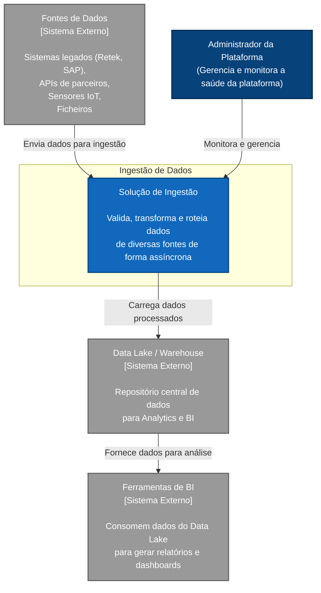
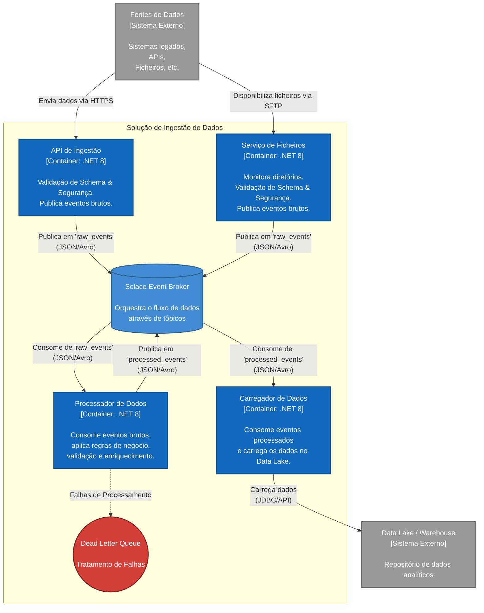

Índice
------

- [Diagrama 1 - Solução de Ingestão - Mermaid](#diagrama-1-solução-de-ingestão-mermaid)
- [Diagrama 2 - Solução de Ingestão - Mermaid](#diagrama-2-solução-de-ingestão-mermaid)

# Diagrama 1 - Solução de Ingestão - Mermaid

# Diagrama 2 - Solução de Ingestão - Mermaid

