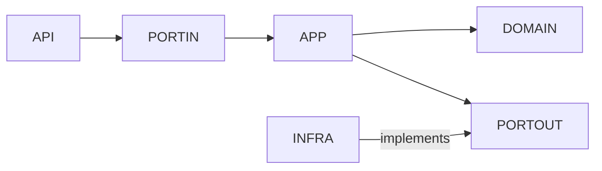

# ADR-005 — Estrutura de Pacotes e Arquitetura

**Status:** Aceito  
**Data:** Março/2026  
**Decisores:** Equipe Técnica

## Contexto

A RFP valoriza "organização por domínio (Domain-Driven Design lite)" e "estrutura de pacotes organizada". É necessário definir como os serviços backend serão estruturados internamente, garantindo separação de responsabilidades, testabilidade e baixo acoplamento.
Além disso, o domínio define o status `DRAFT` como parte do ciclo de vida da mudança, mas na implementação atual a criação vai diretamente para `PREPARED`. É necessário documentar essa decisão.

## Decisão

Adotamos **Arquitetura Hexagonal (Ports & Adapters)** com pacotes organizados por camada dentro de cada bounded context.

## Estrutura de Pacotes

```
com.changeops.changeservice/  
├── api/                          # Adaptadores de entrada (driving)  
│   ├── controller/               # REST controllers  
│   └── dto/                      # Request/Response DTOs  
├── application/                  # Lógica de aplicação  
│   ├── port/  
│   │   ├── in/                   # Use cases (driving ports)  
│   │   └── out/                  # Driven ports (interfaces)  
│   └── service/                  # Implementação dos use cases  
├── domain/                       # Núcleo de domínio (zero dependências externas)  
│   ├── model/                    # Aggregates, entidades  
│   ├── event/                    # Eventos de domínio  
│   ├── exception/                # Exceções de domínio  
│   └── valueobject/              # Value objects (ChangeStatus)  
└── infrastructure/               # Adaptadores de saída (driven)  
    ├── config/                   # Configurações Spring/Kafka  
    ├── kafka/                    # Publisher adapter + IntegrationEvent  
    ├── observability/            # Filtros MDC, métricas  
    ├── persistence/              # JPA entities, repositories, adapters  
    ├── ratelimit/                # Rate limiting  
    └── security/                 # OAuth2, CORS
```

## Regra de Dependência



*   **Domain** não depende de nenhuma outra camada (zero imports de frameworks).
*   **Application**:
    *   Depende apenas do `domain`
    *   Define interfaces (`port/in` e `port/out`)
    *   **Não depende de implementações de infraestrutura**
*   **Infrastructure**:
    *   Implementa os `port/out` definidos pelo application
    *   Depende do módulo de aplicação para cumprir contratos
    *   **Nunca é referenciada diretamente pelo application**
*   **API**:
    *   Atua como adaptador de entrada
    *   Invoca use cases via `port/in`

> Dependências sempre apontam para o centro (Domain), enquanto implementações técnicas ficam na borda (Infrastructure).

## Independência de Serviços

Essa estrutura reforça a independência entre serviços como `change-service` e `deploy-orchestrator`.

Cada serviço:
*   Possui seu próprio domínio isolado
*   Define seus próprios ports e adapters
*   Evolui de forma independente (deploy, versionamento, mudanças internas)
A comunicação entre serviços ocorre exclusivamente via eventos (Kafka), conforme definido nas ADRs anteriores, evitando acoplamento direto entre códigos.

Isso permite:
*   Deploys independentes
*   Evolução assíncrona dos bounded contexts
*   Redução de impacto em mudanças internas

## Status DRAFT e status inicial da mudança

O enum `ChangeStatus` inclui o valor `DRAFT`, porém a factory `Change.create()` define o status inicial diretamente como `PREPARED`. Essa é uma **decisão deliberada de escopo**:
*   No fluxo atual da POC, **não existe transição observável `DRAFT → PREPARED`**. A change é criada e imediatamente persistida em `PREPARED` — nenhum registro com status `DRAFT` será encontrado no banco de dados.
*   A notação `DRAFT → PREPARED` presente em documentações de fluxo descreve uma **intenção futura**, não um estado transitório real na implementação atual.
*   O valor `DRAFT` é mantido no enum exclusivamente para **compatibilidade forward**.
**Status inicial efetivo:** `PREPARED`  
**Roadmap:** A transição real `DRAFT → PREPARED` será introduzida junto ao fluxo de aprovação.

## Exemplo de Testabilidade

A arquitetura permite testar a lógica de aplicação de forma isolada, mockando apenas os ports de saída.

```Java
@ExtendWith(MockitoExtension.class)  
class CreateChangeServiceTest {  
  
    @Mock  
    private ChangeRepositoryPort repository;  
  
    @Mock  
    private PublishEventPort eventPublisher;  
  
    @InjectMocks  
    private CreateChangeService service;  
  
    @Test  
    void shouldCreateChangeAndPublishEvent() {  
        // given  
        var command = new CreateChangeCommand("component-1", "user-1");  
  
        when(repository.save(any())).thenAnswer(invocation -> invocation.getArgument(0));  
  
        // when  
        service.execute(command);  
  
        // then  
        verify(repository).save(any());  
        verify(eventPublisher).publish(any());  
    }  
}
```

Esse teste demonstra:
*   Isolamento completo da lógica de aplicação
*   Ausência de dependência de infraestrutura (JPA, Kafka, etc.)
*   Execução rápida e determinística

## Alternativas Consideradas

### 1. Hexagonal / Ports & Adapters (escolhida)

*   Inversão de dependências clara: domínio no centro, sem acoplamento a frameworks.
*   Testabilidade máxima: serviços testados com mocks dos ports de saída.
*   Substituição de adapters sem impacto no domínio (ex: trocar Kafka por RabbitMQ).
*   Trade-off: mais interfaces e classes que uma abordagem layered simples.

```Java
// HexagonalArchitectureTest.java
@Test
void domainShouldNotDependOnInfrastructure() {
    // Given: classes do domínio
    Set<Class<?>> domainClasses = getClassesInPackage("com.changeops.changeservice.domain");
    
    // When: verificar imports
    List<String> infraImports = domainClasses.stream()
        .flatMap(c -> Arrays.stream(c.getImports()))
        .filter(i -> i.startsWith("com.changeops.changeservice.infrastructure"))
        .toList();
    
    // Then: nenhum import de infraestrutura
    assertThat(infraImports).isEmpty();
}
```

### 2. Camadas tradicionais (Controller → Service → Repository)

*   Simples e familiar para a maioria dos desenvolvedores.
*   Services tendem a acumular lógica (god classes).
*   Repository acoplado ao framework (JPA direto no service).
*   Menor testabilidade.

### 3. Organização por feature/domínio (vertical slicing)

*   Cada feature em um pacote independente.
*   Boa para sistemas muito grandes.
*   Over-engineering para a POC.
*   Dificulta leitura da arquitetura em camadas.

## Trade-offs

| Aspecto | Hexagonal (escolhida) | Camadas tradicionais | Vertical slicing |
| --- | --- | --- | --- |
| Desacoplamento | ✅ Máximo | ❌ Baixo | ⚠ Médio |
| Testabilidade | ✅ Mock de ports | ⚠ Mock de repos JPA | ✅ Boa |
| Complexidade | ⚠ Mais interfaces | ✅ Mínima | ⚠ Alta |
| Substituição de infra | ✅ Via adapter | ❌ Requer refactor | ⚠ Parcial |
| Curva de aprendizado | ⚠ Requer entendimento de ports | ✅ Intuitiva | ⚠ Conceitual |
| Escalabilidade de código | ✅ Boa separação | ⚠ God services | ✅ Boa |

## Consequências

### Positivas
- Isolamento de domínio: regras de negócio são testáveis sem dependências de infraestrutura, facilitando TDD e evolução
- Substituibilidade de adapters: trocar Kafka por SQS, ou PostgreSQL por outro banco, requer apenas nova implementação de porta
- Onboarding acelerado: estrutura padronizada permite que novos desenvolvedores localizem código por convenção, não por exploração

### Negativas / Riscos
- Verbosidade inicial: criação de múltiplos arquivos (model, port, adapter) para features simples pode parecer overhead
- Curva de aprendizado: desenvolvedores não familiarizados com Hexagonal podem cometer erros de acoplamento entre camadas
- Risco de "anemia de domínio": separação excessiva pode levar a modelos sem comportamento, apenas dados

### Mitigações
- Exemplo de feature completa (`CreateChange`) documentado no próprio ADR como referência para novas implementações
- Teste de arquitetura `HexagonalArchitectureTest` verifica que domínio não importa infraestrutura, executado em cada build
- Guidelines de modelagem rica em `docs/ARCHITECTURE.md` com exemplos de entidades com comportamento, não apenas getters/setters

## Perfis de Segurança: Local vs. Produção

A `SecurityConfig` possui duas configurações ativadas por Spring Profile, documentadas aqui como **decisão deliberada de developer experience**:

### Perfil `local` / `test` (demo e desenvolvimento)

```java
@Profile({"local", "test"})
// Todos os requests permitidos sem autenticação
// CORS ainda configurado; rate limiting ativo
```

**Motivação:** Eliminar a necessidade de um Identity Provider (Keycloak, Auth0, Okta) no ambiente de demonstração. Exigir OAuth2 válido tornaria o `make up` não autossuficiente — dependeria de infraestrutura externa ou configuração de IDP local, aumentando a barreira de entrada para avaliadores e desenvolvedores.

**O que permanece ativo mesmo no perfil local:**
- `CorrelationIdFilter` — rastreabilidade preservada
- `RateLimitFilter` — proteção contra flood nos endpoints POST
- CORS configurado — origens permitidas explícitas

### Perfil `prod` / `staging` (padrão em produção)

```java
@Profile("!local & !test")
// OAuth2 Resource Server com JWT
// CustomJwtAuthenticationConverter → roles OPERATOR, ADMIN
// /actuator/prometheus requer role ADMIN
```

**Garantias em produção:**
- JWT validado via JWKS endpoint do IdP
- Role-based access: `OPERATOR` cria/lista mudanças; `ADMIN` acessa métricas
- Stateless (sem sessão/cookie) — compatível com múltiplas réplicas
- CORS restrito a `localhost:*` e `*.changeops.io`

### Por que isso não é uma lacuna de segurança

A autenticação **existe, está implementada e testada** — não foi omitida. A decisão foi desabilitá-la condicionalmente por profile, o que é padrão amplamente adotado em Spring Boot (ex: `spring.security.enabled=false` em perfis de teste). O risco de expor o perfil local em produção é mitigado pelo profile binding explícito — `prod` nunca carrega a configuração permissiva.

## Relacionado a
- [ADR-002](./ADR-002-estrategia-idempotencia.md) — `IdempotencyAdapter` implementa porta de persistência em `infrastructure/persistence`
- [ADR-003](./ADR-003-eventos-dominio-vs-integracao.md) — Eventos de domínio em `domain/model`, envelope em `infrastructure/event`
- [ADR-004](./ADR-004-atualizacao-status-frontend.md) — Hook de frontend isolado em `frontend/hooks/`, sem dependência de backend
- [ADR-006](./ADR-006-checklist-pos-deploy.md) — `PostDeployChecklistService` em `application/service/` segue o mesmo princípio de adapter substituível

## Conformidade com a RFP

| Requisito | Status | Evidência |
|-----------|--------|-----------|
| "Organização por domínio com isolamento de infraestrutura" | ✅ Atendido | Pacotes `domain/`, `application/`, `infrastructure/` com dependências unidirecionais |
| "Testabilidade de regras de negócio sem infraestrutura" | ✅ Atendido | Testes unitários em `domain/` sem mocks de banco ou Kafka |
| "Substituibilidade de adapters para evolução técnica" | ✅ Atendido | Porta `EventPublisher` com implementações `KafkaEventPublisher` e `InMemoryEventPublisher` para testes |
| "Documentação de convenções para novos desenvolvedores" | ✅ Atendido | Exemplo de feature completa no ADR + `docs/ARCHITECTURE.md` com guidelines |
| "Validação automática de arquitetura" | ✅ Atendido | `HexagonalArchitectureTest.java` executado em pipeline CI para prevenir acoplamento indevido |
| "Autenticação presente ou justificadamente desabilitada" | ✅ Atendido | OAuth2 JWT implementado em `SecurityConfig` (perfil `prod`); desabilitado em `local`/`test` por decisão documentada neste ADR |

## Justificativa

A Hexagonal Architecture oferece o melhor equilíbrio entre testabilidade, desacoplamento e manutenibilidade para serviços de domínio focado. O custo adicional de interfaces (ports) é compensado pela qualidade dos testes e pela capacidade de evoluir infraestrutura sem impactar o núcleo de negócio.
