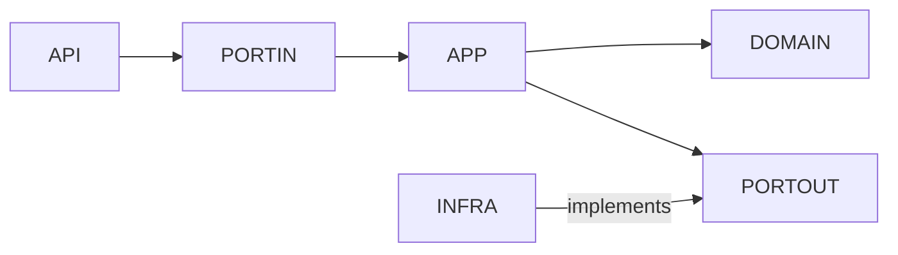

# ADR-005 — Estrutura de Pacotes e Arquitetura

**Status:** Aceito  
**Data:** Março/2026  
**Decisores:** Equipe Técnica

## Contexto

A RFP valoriza "organização por domínio (Domain-Driven Design lite)" e "estrutura de pacotes organizada". É necessário definir como os serviços backend serão estruturados internamente, garantindo separação de responsabilidades, testabilidade e baixo acoplamento.
Além disso, o domínio define o status `DRAFT` como parte do ciclo de vida da mudança, mas na implementação atual a criação vai diretamente para `PREPARED`. É necessário documentar essa decisão.

## Decisão

Adotamos **Arquitetura Hexagonal (Ports & Adapters)** com pacotes organizados por camada dentro de cada bounded context.

## Estrutura de Pacotes
```
com.changeops.changeservice/
├── api/                          # Adaptadores de entrada (driving)
│   ├── controller/               # REST controllers
│   └── dto/                      # Request/Response DTOs
├── application/                  # Lógica de aplicação
│   ├── port/
│   │   ├── in/                   # Use cases (driving ports)
│   │   └── out/                  # Driven ports (interfaces)
│   └── service/                  # Implementação dos use cases
├── domain/                       # Núcleo de domínio (zero dependências externas)
│   ├── model/                    # Aggregates, entidades
│   ├── event/                    # Eventos de domínio
│   ├── exception/                # Exceções de domínio
│   └── valueobject/              # Value objects (ChangeStatus)
└── infrastructure/               # Adaptadores de saída (driven)
    ├── config/                   # Configurações Spring/Kafka
    ├── kafka/                    # Publisher adapter + IntegrationEvent
    ├── observability/            # Filtros MDC, métricas
    ├── persistence/              # JPA entities, repositories, adapters
    ├── ratelimit/                # Rate limiting
    └── security/                 # OAuth2, CORS
```

## Regra de Dependência


*   **Domain** não depende de nenhuma outra camada (zero imports de frameworks).
*   **Application**:
    *   Depende apenas do `domain`
    *   Define interfaces (`port/in` e `port/out`)
    *   **Não depende de implementações de infraestrutura**
*   **Infrastructure**:
    *   Implementa os `port/out` definidos pelo application
    *   Depende do módulo de aplicação para cumprir contratos
    *   **Nunca é referenciada diretamente pelo application**
*   **API**:
    *   Atua como adaptador de entrada
    *   Invoca use cases via `port/in`

> Dependências sempre apontam para o centro (Domain), enquanto implementações técnicas ficam na borda (Infrastructure).

## Independência de Serviços

Cada serviço possui seu próprio domínio isolado, define seus próprios ports e adapters, e evolui de forma independente. A comunicação entre serviços ocorre exclusivamente via eventos (Kafka), evitando acoplamento direto entre códigos.

## Status DRAFT e status inicial da mudança

O enum `ChangeStatus` inclui o valor `DRAFT`, porém a factory `Change.create()` define o status inicial diretamente como `PREPARED`. Essa é uma **decisão deliberada de escopo**:

*   No fluxo atual da POC, **não existe transição observável `DRAFT → PREPARED`**.
*   O valor `DRAFT` é mantido no enum exclusivamente para **compatibilidade forward**.

**Status inicial efetivo:** `PREPARED`  
**Roadmap:** A transição real `DRAFT → PREPARED` será introduzida junto ao fluxo de aprovação.

## Alternativas Consideradas

### 1. Hexagonal / Ports & Adapters (escolhida)

*   Inversão de dependências clara: domínio no centro, sem acoplamento a frameworks.
*   Testabilidade máxima: serviços testados com mocks dos ports de saída.
*   Substituição de adapters sem impacto no domínio.

### 2. Camadas tradicionais (Controller → Service → Repository)

*   Simples e familiar, porém services tendem a acumular lógica.
*   Repository acoplado ao framework.

### 3. Organização por feature/domínio (vertical slicing)

*   Over-engineering para a POC.

## Trade-offs

| Aspecto | Hexagonal (escolhida) | Camadas tradicionais | Vertical slicing |
| --- | --- | --- | --- |
| Desacoplamento | ✅ Máximo | ❌ Baixo | ⚠ Médio |
| Testabilidade | ✅ Mock de ports | ⚠ Mock de repos JPA | ✅ Boa |
| Complexidade | ⚠ Mais interfaces | ✅ Mínima | ⚠ Alta |
| Substituição de infra | ✅ Via adapter | ❌ Requer refactor | ⚠ Parcial |
| Escalabilidade de código | ✅ Boa separação | ⚠ God services | ✅ Boa |

## Consequências

### Positivas
- Isolamento de domínio: regras de negócio testáveis sem dependências de infraestrutura
- Substituibilidade de adapters sem impacto no domínio
- Onboarding acelerado por estrutura padronizada

### Negativas / Riscos
- Verbosidade inicial com múltiplos arquivos por feature
- Curva de aprendizado para desenvolvedores não familiarizados com Hexagonal
- Risco de anemia de domínio

### Mitigações
- Exemplo de feature completa (`CreateChange`) documentado como referência
- Teste de arquitetura `HexagonalArchitectureTest` executado em cada build
- Guidelines de modelagem em `docs/architecture/`

## Perfis de Segurança: Local vs. Produção

A `SecurityConfig` possui duas configurações ativadas por Spring Profile:

### Perfil `local` / `test`
```java
@Profile({"local", "test"})
// Todos os requests permitidos sem autenticação
// CORS ainda configurado; rate limiting ativo
```

**Motivação:** Eliminar a necessidade de um Identity Provider no ambiente de demonstração, tornando o `make up` autossuficiente.

**O que permanece ativo mesmo no perfil local:**
- `CorrelationIdFilter` — rastreabilidade preservada
- `RateLimitFilter` — proteção contra flood nos endpoints POST
- CORS configurado

### Perfil `prod` / `staging`
```java
@Profile("!local & !test")
// OAuth2 Resource Server com JWT
// CustomJwtAuthenticationConverter → roles OPERATOR, ADMIN
```

### Dívida Técnica: Mock JWT para ambiente de desenvolvimento

A solução atual utiliza o header `X-User-Id` combinado com o perfil `local` para simular identidade do usuário sem Keycloak. Essa abordagem introduz lógica condicional baseada em perfil no controller (`resolveRequestedBy`), o que não deveria existir em código de produção.

A solução correta — um `JwtDecoder` mock via `@Profile("local")` que aceita tokens sem validação de assinatura — está registrada como dívida técnica na **ADR-007** e será implementada antes do go-live.

## Relacionado a
- [ADR-002](./ADR-002-estrategia-idempotencia.md) — `IdempotencyAdapter` em `infrastructure/persistence`
- [ADR-003](./ADR-003-eventos-dominio-vs-integracao.md) — Eventos de domínio em `domain/`, envelope em `infrastructure/kafka/`
- [ADR-004](./ADR-004-atualizacao-status-frontend.md) — Hook de frontend isolado em `frontend/hooks/`
- [ADR-006](./ADR-006-checklist-pos-deploy.md) — `PostDeployChecklistService` em `application/service/`
- [ADR-007](./ADR-007-autenticacao-desenvolvimento.md) — Dívida técnica de autenticação em ambiente de desenvolvimento

## Conformidade com a RFP

| Requisito | Status | Evidência |
|-----------|--------|-----------|
| "Organização por domínio com isolamento de infraestrutura" | ✅ Atendido | Pacotes `domain/`, `application/`, `infrastructure/` com dependências unidirecionais |
| "Testabilidade de regras de negócio sem infraestrutura" | ✅ Atendido | Testes unitários em `domain/` sem mocks de banco ou Kafka |
| "Substituibilidade de adapters para evolução técnica" | ✅ Atendido | Porta `PublishEventPort` com implementações `KafkaEventPublisherAdapter` e `InMemoryEventPublisher` para testes |
| "Documentação de convenções para novos desenvolvedores" | ✅ Atendido | Exemplo de feature completa no ADR + diagramas em `docs/architecture/` |
| "Validação automática de arquitetura" | ✅ Atendido | `HexagonalArchitectureTest.java` executado em pipeline CI |
| "Autenticação presente ou justificadamente desabilitada" | ✅ Atendido | OAuth2 JWT implementado em `SecurityConfig` (perfil `prod`); desabilitado em `local`/`test` por decisão documentada |

## Justificativa

A Hexagonal Architecture oferece o melhor equilíbrio entre testabilidade, desacoplamento e manutenibilidade. O custo adicional de interfaces é compensado pela qualidade dos testes e pela capacidade de evoluir infraestrutura sem impactar o núcleo de negócio.