# Guia de Arquitetura — ChangeOps Dashboard

> **Apresentação guiada** da arquitetura do sistema ChangeOps Dashboard.  
> Cada seção contém um diagrama Mermaid e trechos de código relevantes das classes envolvidas.  
> Use o índice abaixo para navegar entre os fluxos.

---

## Índice

| # | Seção | Descrição |
|---|-------|-----------|
| 1 | [Visão Geral da Arquitetura](#1-visão-geral-da-arquitetura) | Diagrama de containers C4 — todos os serviços e suas conexões |
| 2 | [Máquina de Estados — ChangeStatus](#2-máquina-de-estados--changestatus) | Ciclo de vida de uma Change (PREPARED → COMPLETED / FAILED) |
| 3 | [Fluxo 1A — Criação de Change via Frontend](#3-fluxo-1a--criação-de-change-via-frontend) | Do formulário React até a resposta 201 e toast de sucesso |
| 4 | [Fluxo 1B — Criação de Change (Detalhe Backend)](#4-fluxo-1b--criação-de-change-detalhe-backend) | CorrelationIdFilter → Controller → Domain → DB → Kafka |
| 5 | [Listagem e Polling — Frontend](#5-listagem-e-polling--frontend) | Carregamento inicial + polling automático a cada 5s |
| 6 | [Timeline de Eventos — Frontend](#6-timeline-de-eventos--frontend) | Seleção de change → exibição do histórico de eventos |
| 7 | [Fluxo 2A — Orquestração de Deploy (Happy Path)](#7-fluxo-2a--orquestração-de-deploy-happy-path) | Kafka → Idempotência → Checklist → Status → Resultado |
| 8 | [Fluxo 2B — Idempotência (Evento Duplicado)](#8-fluxo-2b--idempotência-evento-duplicado) | Segundo envio do mesmo evento → descarte seguro |
| 9 | [Fluxo 2C — Retry e Dead Letter Topic (DLT)](#9-fluxo-2c--retry-e-dead-letter-topic-dlt) | Falha → backoff exponencial → DLT após 4 tentativas |
| 10 | [Fluxo 2D — Poison Pill (Erro de Deserialização)](#10-fluxo-2d--poison-pill-erro-de-deserialização) | Mensagem malformada → DLT sem retry |
| 11 | [Fluxo 2E — Falha na Publicação → DLQ](#11-fluxo-2e--falha-na-publicação--dlq) | Erro ao publicar resultado → envio para DLQ |
| 12 | [Observabilidade — Métricas e Dashboards](#12-observabilidade--métricas-e-dashboards) | Micrometer → Prometheus → Grafana |
| 13 | [Observabilidade — Logs e Correlation ID](#13-observabilidade--logs-e-correlation-id) | Logs estruturados JSON + rastreabilidade ponta a ponta |
| 14 | [Tópicos Kafka e Contratos](#14-tópicos-kafka-e-contratos) | Mapa de tópicos, envelope IntegrationEvent, schema do banco |

---

## 1. Visão Geral da Arquitetura

Diagrama de containers no estilo C4 — mostra todos os serviços, bancos de dados, broker de mensageria e stack de observabilidade.

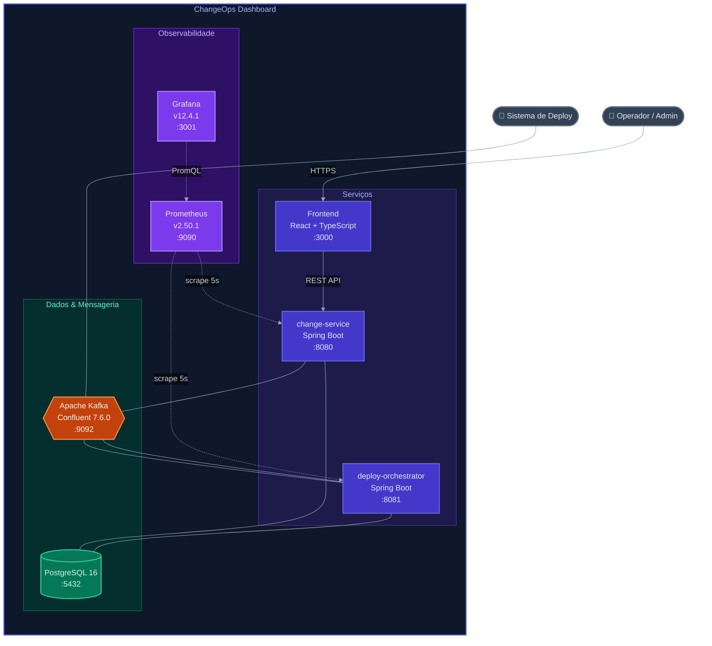
```mermaid
%%{init: {'theme':'dark', 'themeVariables':{'fontSize':'16px','lineColor':'#94A3B8','edgeLabelBackground':'transparent'}}}%%
flowchart TD
    subgraph ext[" "]
        user(["👤 Operador / Admin"])
        deploy_system(["🔧 Sistema de Deploy"])
    end

    subgraph boundary["ChangeOps Dashboard"]
        direction TB
        subgraph services["Serviços"]
            direction LR
            frontend["Frontend<br/>React + TypeScript<br/>:3000"]
            change_service["change-service<br/>Spring Boot<br/>:8080"]
            deploy_orchestrator["deploy-orchestrator<br/>Spring Boot<br/>:8081"]
        end
        subgraph infra[" "]
            direction LR
            subgraph data["Dados & Mensageria"]
                direction TB
                data_pad[ ]:::hidden
                data_pad ~~~ kafka
                kafka{{"Apache Kafka<br/>Confluent 7.6.0<br/>:9092"}}
                postgres[("PostgreSQL 16<br/>:5432")]
                kafka ~~~ postgres
            end
            subgraph obs["Observabilidade"]
                direction TB
                obs_pad[ ]:::hidden
                obs_pad ~~~ grafana
                grafana["Grafana<br/>v12.4.1<br/>:3001"]
                prometheus["Prometheus<br/>v2.50.1<br/>:9090"]
            end
        end
    end

    user -->|HTTPS| frontend
    frontend -->|REST API| change_service
    deploy_system --- kafka
    change_service --- postgres
    change_service --- kafka
    kafka --- deploy_orchestrator
    deploy_orchestrator --- postgres
    deploy_orchestrator --- kafka
    prometheus -.->|scrape 5s| change_service
    prometheus -.->|scrape 5s| deploy_orchestrator
    grafana -.->|PromQL| prometheus

    classDef person fill:#334155,stroke:#64748B,color:#E2E8F0,stroke-width:2px
    classDef svc fill:#4338CA,stroke:#6366F1,color:#E0E7FF,stroke-width:2px
    classDef db fill:#047857,stroke:#34D399,color:#D1FAE5,stroke-width:2px
    classDef broker fill:#C2410C,stroke:#FB923C,color:#FFF7ED,stroke-width:2px
    classDef monitoring fill:#7C3AED,stroke:#A78BFA,color:#EDE9FE,stroke-width:2px
    classDef extSys fill:#334155,stroke:#64748B,color:#E2E8F0,stroke-width:2px
    classDef hidden fill:transparent,stroke:none,color:transparent,stroke-width:0px

    class user person
    class frontend,change_service,deploy_orchestrator svc
    class postgres db
    class kafka broker
    class prometheus,grafana monitoring
    class deploy_system extSys
    style ext fill:none,stroke:none
    style infra fill:none,stroke:none
    style boundary fill:#0F172A,stroke:#6366F1,stroke-width:2px,color:#A5B4FC
    style services fill:#1E1B4B,stroke:#4338CA,stroke-width:1px,color:#A5B4FC
    style data fill:#042F2E,stroke:#047857,stroke-width:1px,color:#5EEAD4
    style obs fill:#2E1065,stroke:#7C3AED,stroke-width:1px,color:#C4B5FD
```

**Componentes principais:**

| Serviço | Porta | Responsabilidade |
|---------|-------|------------------|
| **Frontend** (React + TypeScript) | 3000 | Interface do operador — formulário, listagem, timeline |
| **change-service** (Spring Boot) | 8080 | API REST — criação, consulta e timeline de changes |
| **deploy-orchestrator** (Spring Boot) | 8081 | Consumidor Kafka — orquestração pós-deploy, idempotência, checklist |
| **PostgreSQL 16** | 5432 | Banco compartilhado — tabelas `changes`, `change_events`, `processed_events` |
| **Apache Kafka** (Confluent 7.6.0) | 9092 | Broker — tópicos `change.prepared`, `deploy.finished`, `change.result` |
| **Prometheus** | 9090 | Coleta de métricas (scrape a cada 5s) |
| **Grafana** | 3001 | Dashboards de métricas e logs |

[← Voltar ao Índice](#índice)

---

## 2. Máquina de Estados — ChangeStatus

Toda change transita por estados bem definidos. Flow 1 cria com status `PREPARED`; Flow 2 transiciona para `COMPLETED` ou `FAILED`.

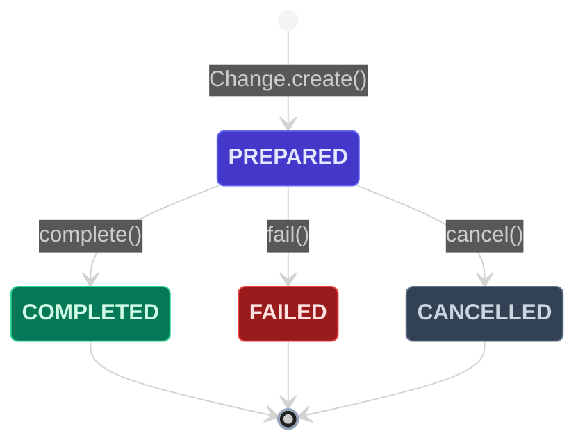
```mermaid
%%{init: {'theme':'dark', 'themeVariables':{'fontSize':'16px','primaryColor':'#4338CA','primaryTextColor':'#E0E7FF','primaryBorderColor':'#6366F1','lineColor':'#94A3B8','secondaryColor':'#1E1B4B','tertiaryColor':'#B45309'}}}%%
stateDiagram-v2
    classDef svcState fill:#4338CA,stroke:#6366F1,color:#E0E7FF,font-weight:bold
    classDef doneState fill:#047857,stroke:#34D399,color:#D1FAE5,font-weight:bold
    classDef failState fill:#991B1B,stroke:#EF4444,color:#FEE2E2,font-weight:bold
    classDef cancelState fill:#334155,stroke:#64748B,color:#CBD5E1,font-weight:bold

    [*] --> PREPARED : Change.create()
    PREPARED --> COMPLETED : complete()
    PREPARED --> FAILED : fail()
    PREPARED --> CANCELLED : cancel()
    COMPLETED --> [*]
    FAILED --> [*]
    CANCELLED --> [*]

    class PREPARED svcState
    class COMPLETED doneState
    class FAILED failState
    class CANCELLED cancelState
```

<details>
<summary>Código — ChangeStatus.java / Change.java</summary>

**Enum no domínio** — `ChangeStatus.java`:

```java
public enum ChangeStatus {
    DRAFT,        // Reservado para workflows de aprovação (futuro)
    PREPARED,     // Status inicial — change pronta para deploy
    COMPLETED,    // Deploy bem-sucedido + checklist aprovado
    FAILED,       // Deploy falhou ou checklist reprovou
    CANCELLED     // Cancelamento pelo operador (futuro)
}
```

**Transições no aggregate root** — `Change.java`:

```java
public void complete() {
    if (this.status != ChangeStatus.PREPARED) {
        throw new InvalidChangeStateException(
                "Cannot complete change in status: " + this.status);
    }
    this.status = ChangeStatus.COMPLETED;
    this.updatedAt = Instant.now();
}

public void fail() {
    if (this.status != ChangeStatus.PREPARED) {
        throw new InvalidChangeStateException(
                "Cannot fail change in status: " + this.status);
    }
    this.status = ChangeStatus.FAILED;
    this.updatedAt = Instant.now();
}
```

</details>

[← Voltar ao Índice](#índice)

---

## 3. Fluxo 1A — Criação de Change via Frontend

O operador preenche o formulário, o React envia via Axios e exibe uma mensagem de sucesso.

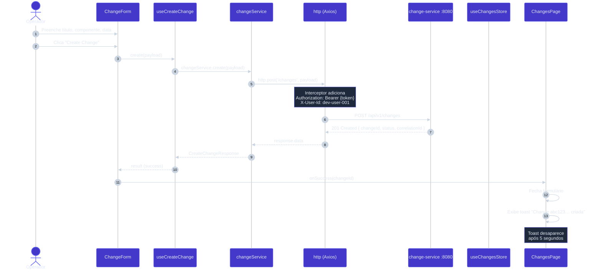
```mermaid
%%{init: {'theme':'dark', 'themeVariables':{'fontSize':'14px','actorTextColor':'#E0E7FF','actorBkg':'#4338CA','actorBorder':'#6366F1','activationBorderColor':'#6366F1','signalColor':'#CBD5E1','signalTextColor':'#E2E8F0','noteBkgColor':'#1E293B','noteBorderColor':'#6366F1','noteTextColor':'#E2E8F0','altSectionBkgColor':'#0F172A','labelTextColor':'#A5B4FC'}}}%%
sequenceDiagram
    autonumber
    actor Operador
    participant CF as ChangeForm
    participant UC as useCreateChange
    participant SVC as changeService
    participant HTTP as http (Axios)
    participant API as change-service :8080
    participant Store as useChangesStore
    participant Page as ChangesPage

    Operador->>CF: Preenche título, componente, data
    Operador->>CF: Clica "Create Change"
    CF->>UC: create(payload)
    UC->>SVC: changeService.create(payload)
    SVC->>HTTP: http.post('/changes', payload)

    Note over HTTP: Interceptor adiciona<br/>Authorization: Bearer {token}<br/>X-User-Id: dev-user-001

    HTTP->>API: POST /api/v1/changes
    API-->>HTTP: 201 Created { changeId, status, correlationId }
    HTTP-->>SVC: response.data
    SVC-->>UC: CreateChangeResponse
    UC-->>CF: result (success)
    CF->>Page: onSuccess(changeId)
    Page->>Page: Fecha formulário
    Page->>Page: Exibe toast "Change abc123… criada"

    Note over Page: Toast desaparece<br/>após 5 segundos
```

<details>
<summary>Trechos de Código — ChangeForm, useCreateChange, changeService, http</summary>

**`ChangeForm.tsx`** — submit do formulário:

```tsx
const handleSubmit = async (e: FormEvent) => {
  e.preventDefault()
  const payload: CreateChangePayload = {
    ...form,
    scheduledAt: new Date(form.scheduledAt).toISOString(),
  }
  const result = await create(payload)
  if (result) {
    setForm(EMPTY)
    onSuccess?.(result.changeId)
  }
}
```

**`useCreateChange.ts`** — hook de criação:

```typescript
export function useCreateChange() {
  const [loading, setLoading] = useState(false)
  const [error, setError] = useState<ApiError | null>(null)

  const create = async (payload: CreateChangePayload): Promise<CreateChangeResponse | null> => {
    setLoading(true)
    setError(null)
    try {
      const data = await changeService.create(payload)
      setResult(data)
      return data
    } catch (e) {
      setError(e as ApiError)
      return null
    } finally {
      setLoading(false)
    }
  }
  // ...
}
```

**`changeService.ts`** — camada de serviço HTTP:

```typescript
const changeService = {
  async create(payload: CreateChangePayload): Promise<CreateChangeResponse> {
    const { data } = await http.post<CreateChangeResponse>('/changes', payload)
    return data
  },
}
```

**`http.ts`** — interceptors do Axios:

```typescript
http.interceptors.request.use((config) => {
  const token = localStorage.getItem('access_token')
  if (token) config.headers.Authorization = `Bearer ${token}`
  const userId = localStorage.getItem('user_id') ?? 'dev-user-001'
  config.headers['X-User-Id'] = userId
  return config
})

http.interceptors.response.use(
  (res) => res,
  (err: AxiosError) => {
    const data = err.response?.data as Partial<ApiError> | undefined
    const apiError: ApiError = {
      title: data?.title ?? 'Unexpected Error',
      detail: data?.detail ?? err.message,
      status: err.response?.status ?? 0,
      fields: data?.fields,
      timestamp: data?.timestamp ?? new Date().toISOString(),
    }
    return Promise.reject(apiError)
  },
)
```

</details>

[← Voltar ao Índice](#índice)

---

## 4. Fluxo 1B — Criação de Change (Detalhe Backend)

O que acontece dentro do `change-service` quando a requisição `POST /api/v1/changes` chega.

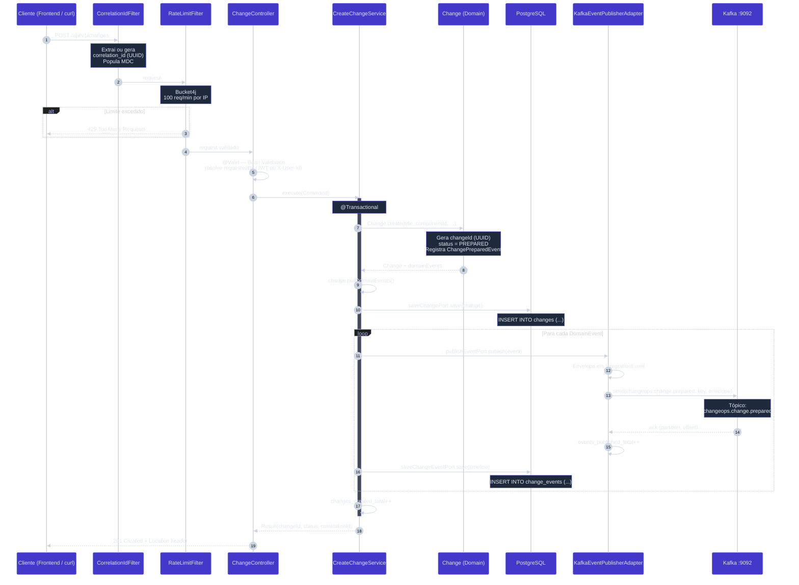
```mermaid
%%{init: {'theme':'dark', 'themeVariables':{'fontSize':'14px','actorTextColor':'#E0E7FF','actorBkg':'#4338CA','actorBorder':'#6366F1','activationBorderColor':'#6366F1','signalColor':'#CBD5E1','signalTextColor':'#E2E8F0','noteBkgColor':'#1E293B','noteBorderColor':'#6366F1','noteTextColor':'#E2E8F0','altSectionBkgColor':'#0F172A','labelTextColor':'#A5B4FC'}}}%%
sequenceDiagram
    autonumber
    participant Client as Cliente (Frontend / curl)
    participant CIF as CorrelationIdFilter
    participant RLF as RateLimitFilter
    participant CTRL as ChangeController
    participant SVC as CreateChangeService
    participant DOM as Change (Domain)
    participant DB as PostgreSQL
    participant KP as KafkaEventPublisherAdapter
    participant Kafka as Kafka :9092

    Client->>CIF: POST /api/v1/changes
    Note over CIF: Extrai ou gera<br/>correlation_id (UUID)<br/>Popula MDC

    CIF->>RLF: request
    Note over RLF: Bucket4j<br/>100 req/min por IP

    alt Limite excedido
        RLF-->>Client: 429 Too Many Requests
    end

    RLF->>CTRL: request validado
    CTRL->>CTRL: @Valid — Bean Validation<br/>resolve requestedBy (JWT ou X-User-Id)
    CTRL->>SVC: execute(Command)

    activate SVC
    Note over SVC: @Transactional

    SVC->>DOM: Change.create(title, componentId, ...)
    Note over DOM: Gera changeId (UUID)<br/>status = PREPARED<br/>Registra ChangePreparedEvent

    DOM-->>SVC: Change + domainEvents

    SVC->>SVC: change.pullDomainEvents()
    SVC->>DB: saveChangePort.save(change)
    Note over DB: INSERT INTO changes (...)

    loop Para cada DomainEvent
        SVC->>KP: publishEventPort.publish(event)
        KP->>KP: Envelopa em IntegrationEvent
        KP->>Kafka: send(changeops.change.prepared, key, envelope)
        Note over Kafka: Tópico:<br/>changeops.change.prepared
        Kafka-->>KP: ack (partition, offset)
        KP->>KP: events_published_total++

        SVC->>DB: saveChangeEventPort.save(timeline)
        Note over DB: INSERT INTO change_events (...)
    end

    SVC->>SVC: changes_created_total++
    deactivate SVC

    SVC-->>CTRL: Result(changeId, status, correlationId)
    CTRL-->>Client: 201 Created + Location header
```

<details>
<summary>Trechos de Código — CorrelationIdFilter, ChangeController, CreateChangeService, Change, KafkaEventPublisherAdapter</summary>

**`CorrelationIdFilter.java`** — gera e propaga o correlation_id:

```java
@Component
@Order(1)
public class CorrelationIdFilter implements Filter {

    @Override
    public void doFilter(ServletRequest request, ServletResponse response, FilterChain chain)
            throws IOException, ServletException {
        HttpServletRequest httpRequest = (HttpServletRequest) request;
        String correlationId = httpRequest.getHeader("X-Correlation-Id");
        if (correlationId == null || correlationId.isBlank()) {
            correlationId = UUID.randomUUID().toString();
        }
        MDC.put("correlation_id", correlationId);
        MDC.put("service", "change-service");
        ((HttpServletResponse) response).setHeader("X-Correlation-Id", correlationId);
        try {
            chain.doFilter(request, response);
        } finally {
            MDC.clear();
        }
    }
}
```

**`ChangeController.java`** — endpoint REST:

```java
@PostMapping
public ResponseEntity<CreateChangeResponse> create(
        @Valid @RequestBody CreateChangeRequest request,
        @RequestHeader(value = "X-User-Id", required = false) String userId,
        @AuthenticationPrincipal Jwt jwt) {

    String requestedBy = resolveRequestedBy(userId, jwt, request.requestedBy());
    UUID correlationId = UUID.fromString(MDC.get("correlation_id"));

    CreateChangeUseCase.Result result = createChangeUseCase.execute(
            new CreateChangeUseCase.Command(
                    request.title(), request.description(),
                    request.componentId(), requestedBy,
                    request.scheduledAt(), correlationId));

    URI location = ServletUriComponentsBuilder.fromCurrentRequest()
            .path("/{id}").buildAndExpand(result.changeId()).toUri();

    return ResponseEntity.created(location).body(new CreateChangeResponse(
            result.changeId(), result.status(),
            result.correlationId(), result.createdAt()));
}
```

**`CreateChangeService.java`** — orquestração do caso de uso:

```java
@Override
@Transactional
public Result execute(Command command) {
    Change change = Change.create(
            command.title(), command.description(),
            command.componentId(), command.requestedBy(),
            command.scheduledAt(), command.correlationId());

    List<DomainEvent> events = change.pullDomainEvents();
    Change saved = saveChangePort.save(change);

    events.forEach(event -> {
        publishEventPort.publish(event);
        persistEventToTimeline(saved, event);
    });

    changesCreatedCounter.increment();
    return new Result(saved.getChangeId(), saved.getStatus(),
                      saved.getCorrelationId(), saved.getCreatedAt());
}
```

**`Change.create()`** — factory method do aggregate root (domínio puro):

```java
public static Change create(String title, String description, String componentId,
                             String requestedBy, Instant scheduledAt, UUID correlationId) {
    UUID changeId = UUID.randomUUID();
    Instant now = Instant.now();

    Change change = Change.builder()
            .changeId(changeId).title(title).description(description)
            .componentId(componentId).requestedBy(requestedBy)
            .scheduledAt(scheduledAt).status(ChangeStatus.PREPARED)
            .correlationId(correlationId).createdAt(now).updatedAt(now)
            .build();

    change.domainEvents.add(new ChangePreparedEvent(
            changeId, componentId, requestedBy, scheduledAt, correlationId, now));

    return change;
}
```

**`KafkaEventPublisherAdapter.java`** — envelopa e publica no Kafka:

```java
private void publishChangePrepared(ChangePreparedEvent event) {
    String key = event.changeId().toString();
    IntegrationEvent envelope = IntegrationEvent.builder()
            .eventType("ChangePreparedEvent")
            .version("1.0")
            .correlationId(event.correlationId())
            .occurredAt(Instant.now())
            .payload(new ChangePreparedPayload(
                    event.changeId(), event.componentId(),
                    event.requestedBy(), event.scheduledAt()))
            .build();

    SendResult<String, IntegrationEvent> result =
            kafkaTemplate.send(changePreparedTopic, key, envelope)
                         .get(10, TimeUnit.SECONDS);
    eventsPublishedCounter.increment();
}
```

</details>

[← Voltar ao Índice](#índice)

---

## 5. Listagem e Polling — Frontend

O `ChangeList` carrega a lista de changes na montagem do componente e inicia um polling silencioso a cada 5 segundos para manter os dados atualizados.

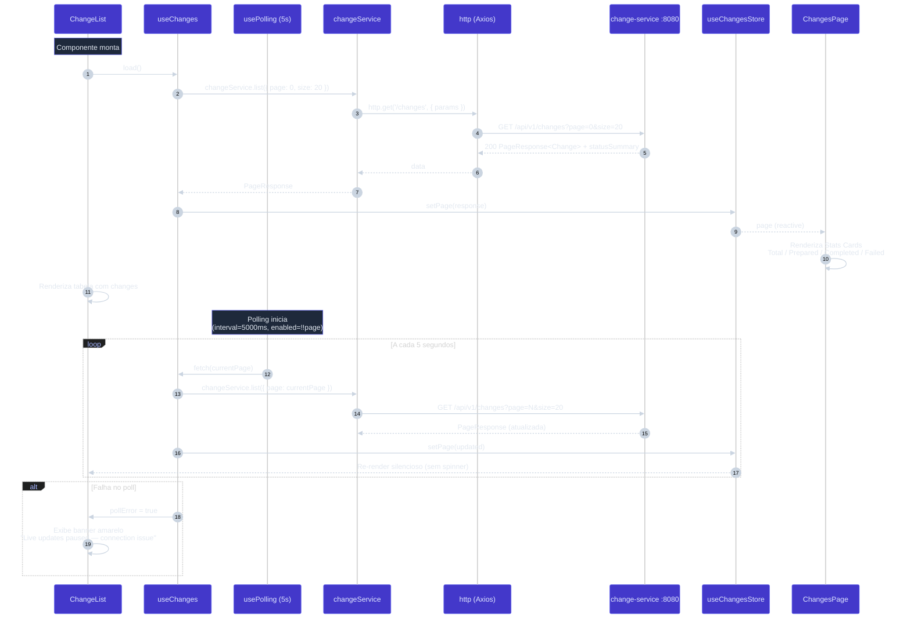
```mermaid
%%{init: {'theme':'dark', 'themeVariables':{'fontSize':'14px','actorTextColor':'#E0E7FF','actorBkg':'#4338CA','actorBorder':'#6366F1','activationBorderColor':'#6366F1','signalColor':'#CBD5E1','signalTextColor':'#E2E8F0','noteBkgColor':'#1E293B','noteBorderColor':'#6366F1','noteTextColor':'#E2E8F0','altSectionBkgColor':'#0F172A','labelTextColor':'#A5B4FC'}}}%%
sequenceDiagram
    autonumber
    participant CL as ChangeList
    participant UC as useChanges
    participant Poll as usePolling (5s)
    participant SVC as changeService
    participant HTTP as http (Axios)
    participant API as change-service :8080
    participant Store as useChangesStore
    participant Page as ChangesPage

    Note over CL: Componente monta

    CL->>UC: load()
    UC->>SVC: changeService.list({ page: 0, size: 20 })
    SVC->>HTTP: http.get('/changes', { params })
    HTTP->>API: GET /api/v1/changes?page=0&size=20
    API-->>HTTP: 200 PageResponse<Change> + statusSummary
    HTTP-->>SVC: data
    SVC-->>UC: PageResponse
    UC->>Store: setPage(response)
    Store-->>Page: page (reactive)
    Page->>Page: Renderiza Stats Cards<br/>Total / Prepared / Completed / Failed
    CL->>CL: Renderiza tabela com changes

    Note over Poll: Polling inicia<br/>(interval=5000ms, enabled=!!page)

    loop A cada 5 segundos
        Poll->>UC: fetch(currentPage)
        UC->>SVC: changeService.list({ page: currentPage })
        SVC->>API: GET /api/v1/changes?page=N&size=20
        API-->>SVC: PageResponse (atualizada)
        UC->>Store: setPage(updated)
        Store-->>CL: Re-render silencioso (sem spinner)
    end

    alt Falha no poll
        UC->>CL: pollError = true
        CL->>CL: Exibe banner amarelo<br/>"Live updates paused — connection issue"
    end
```

<details>
<summary>Trechos de Código — usePolling, useChanges, useChangesStore</summary>

**`usePolling.ts`** — hook reutilizável de polling:

```typescript
export function usePolling(
  callback: () => void | Promise<void>,
  { interval = 5_000, enabled = true }: UsePollingOptions = {},
) {
  const savedCallback = useRef(callback)
  const timerRef = useRef<ReturnType<typeof setTimeout> | null>(null)

  useEffect(() => { savedCallback.current = callback }, [callback])

  useEffect(() => {
    if (!enabled) return
    const tick = async () => {
      try {
        await savedCallback.current()
      } finally {
        timerRef.current = setTimeout(tick, interval)  // Agenda próximo tick após conclusão
      }
    }
    timerRef.current = setTimeout(tick, interval)
    return () => { if (timerRef.current) clearTimeout(timerRef.current) }
  }, [enabled, interval])

  return { stop }
}
```

**`useChanges.ts`** — hook de listagem + polling:

```typescript
export function useChanges() {
  const { page, currentPage, setPage, setCurrentPage } = useChangesStore()
  const [loading, setLoading] = useState(false)
  const [pollError, setPollError] = useState(false)

  const fetch = useCallback(async (pageNum: number) => {
    try {
      const data = await changeService.list({ page: pageNum, size: 20 })
      setPage(data)
      setPollError(false)
    } catch (e) {
      setPollError(true)
    }
  }, [setPage])

  // Polling em background
  usePolling(() => fetch(currentPage), { interval: 5_000, enabled: !!page })

  return { changes: page?.content ?? [], page, loading, pollError, load, goToPage }
}
```

**`useChangesStore.ts`** — Zustand store centralizado:

```typescript
export const useChangesStore = create<ChangesState>((set) => ({
  page: null,
  currentPage: 0,
  selectedChangeId: null,

  setPage: (page) => set({ page }),
  setCurrentPage: (currentPage) => set({ currentPage }),
  setSelectedChangeId: (id) => set({ selectedChangeId: id }),

  upsertChange: (change) =>
    set((state) => {
      if (!state.page) return {}
      const content = state.page.content.map((c) =>
        c.changeId === change.changeId ? change : c,
      )
      return { page: { ...state.page, content } }
    }),
}))
```

</details>

[← Voltar ao Índice](#índice)

---

## 6. Timeline de Eventos — Frontend

Ao selecionar uma change na tabela, o painel lateral de timeline é exibido com o histórico de eventos — cada transição de estado é registrada.

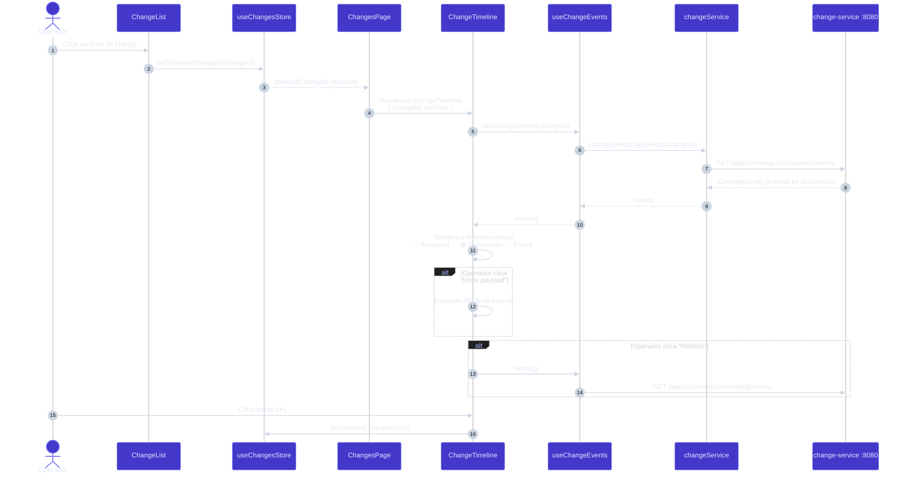
```mermaid
%%{init: {'theme':'dark', 'themeVariables':{'fontSize':'14px','actorTextColor':'#E0E7FF','actorBkg':'#4338CA','actorBorder':'#6366F1','activationBorderColor':'#6366F1','signalColor':'#CBD5E1','signalTextColor':'#E2E8F0','noteBkgColor':'#1E293B','noteBorderColor':'#6366F1','noteTextColor':'#E2E8F0','altSectionBkgColor':'#0F172A','labelTextColor':'#A5B4FC'}}}%%
sequenceDiagram
    autonumber
    actor Operador
    participant CL as ChangeList
    participant Store as useChangesStore
    participant Page as ChangesPage
    participant TL as ChangeTimeline
    participant UC as useChangeEvents
    participant SVC as changeService
    participant API as change-service :8080

    Operador->>CL: Clica na linha da change
    CL->>Store: setSelectedChangeId(changeId)
    Store-->>Page: selectedChangeId (reactive)

    Page->>TL: Renderiza ChangeTimeline<br/>{ changeId, onClose }

    TL->>UC: useChangeEvents(changeId)
    UC->>SVC: changeService.getEvents(changeId)
    SVC->>API: GET /api/v1/changes/{changeId}/events
    API-->>SVC: ChangeEvent[] (ordered by occurredAt)
    SVC-->>UC: events
    UC-->>TL: events[]

    TL->>TL: Renderiza timeline vertical<br/>🔵 Prepared → 🟢 Completed / 🔴 Failed

    alt Operador clica "Show payload"
        TL->>TL: Expande JSON do evento
    end

    alt Operador clica "Refresh"
        TL->>UC: reload()
        UC->>API: GET /api/v1/changes/{changeId}/events
    end

    Operador->>TL: Clica fechar (✕)
    TL->>Store: setSelectedChangeId(null)
```

<details>
<summary>Trechos de Código — useChangeEvents, changeService, types</summary>

**`useChangeEvents.ts`** — hook de carregamento de eventos:

```typescript
export function useChangeEvents(changeId: string | null) {
  const [events, setEvents] = useState<ChangeEvent[]>([])
  const [loading, setLoading] = useState(false)
  const [error, setError] = useState<ApiError | null>(null)

  const load = useCallback(async () => {
    if (!changeId) return
    setLoading(true)
    try {
      const data = await changeService.getEvents(changeId)
      setEvents(data)
    } catch (e) {
      setError(e as ApiError)
    } finally {
      setLoading(false)
    }
  }, [changeId])

  useEffect(() => { load() }, [load])

  return { events, loading, error, reload: load }
}
```

**`changeService.ts`** — chamada HTTP para eventos:

```typescript
async getEvents(changeId: string): Promise<ChangeEvent[]> {
  const { data } = await http.get<ChangeEvent[]>(`/changes/${changeId}/events`)
  return data
}
```

**Tipos TypeScript** — `types/index.ts`:

```typescript
export interface ChangeEvent {
  eventId: string
  changeId: string
  eventType: string       // 'ChangePreparedEvent', 'ChangeCompletedEvent', 'ChangeFailedEvent'
  payload: string         // JSON stringified
  occurredAt: string      // ISO-8601
}

export interface PageResponse<T> {
  content: T[]
  totalElements: number
  totalPages: number
  number: number          // 0-indexed
  size: number
  first: boolean
  last: boolean
  statusSummary?: Partial<Record<ChangeStatus, number>>
}
```

</details>

[← Voltar ao Índice](#índice)

---

## 7. Fluxo 2A — Orquestração de Deploy (Happy Path)

Quando o sistema de deploy publica um `DeployFinishedEvent` no Kafka, o `deploy-orchestrator` consome, verifica idempotência, executa o checklist pós-deploy, atualiza o status e publica o resultado.

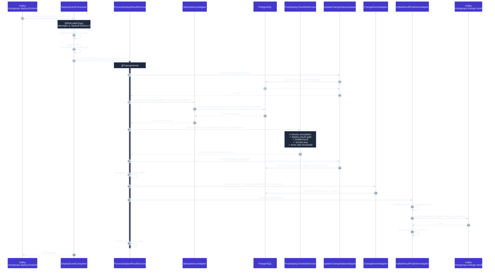
```mermaid
%%{init: {'theme':'dark', 'themeVariables':{'fontSize':'14px','actorTextColor':'#E0E7FF','actorBkg':'#4338CA','actorBorder':'#6366F1','activationBorderColor':'#6366F1','signalColor':'#CBD5E1','signalTextColor':'#E2E8F0','noteBkgColor':'#1E293B','noteBorderColor':'#6366F1','noteTextColor':'#E2E8F0','altSectionBkgColor':'#0F172A','labelTextColor':'#A5B4FC'}}}%%
sequenceDiagram
    autonumber
    participant Kafka_IN as Kafka<br/>changeops.deploy.finished
    participant DEC as DeployEventConsumer
    participant SVC as ProcessDeployResultService
    participant IDP as IdempotencyAdapter
    participant DB as PostgreSQL
    participant CHK as PostDeployChecklistService
    participant UPD as UpdateChangeStatusAdapter
    participant EVT as ChangeEventAdapter
    participant KP as KafkaResultPublisherAdapter
    participant Kafka_OUT as Kafka<br/>changeops.change.result

    Kafka_IN->>DEC: ConsumerRecord(DeployFinishedEvent)
    Note over DEC: @RetryableTopic<br/>attempts=4, backoff 500ms×2

    DEC->>DEC: Valida payload (null check)
    DEC->>DEC: Popula MDC<br/>(correlation_id, deploy_id)

    DEC->>SVC: processDeployResultUseCase.execute(event)
    activate SVC
    Note over SVC: @Transactional

    SVC->>UPD: existsByChangeId(changeId)
    UPD->>DB: SELECT exists FROM changes
    DB-->>UPD: true
    UPD-->>SVC: ✓ existe

    SVC->>IDP: tryMarkAsProcessed(deployId, "deploy-orchestrator")
    IDP->>DB: INSERT processed_events ON CONFLICT DO NOTHING
    DB-->>IDP: 1 (novo registro)
    IDP-->>SVC: true (primeira vez)

    SVC->>CHK: execute(changeId, deployId, deploySucceeded=true)
    Note over CHK: 4 checks simulados:<br/>✓ deploy-result-gate<br/>✓ healthcheck<br/>✓ smoke-test<br/>✓ error-rate-threshold
    CHK-->>SVC: ChecklistResult(allPassed=true)

    SVC->>UPD: markCompleted(changeId)
    UPD->>DB: UPDATE changes SET status='COMPLETED'
    SVC->>SVC: changes_completed_total++

    SVC->>EVT: save(changeId, "ChangeCompletedEvent", payload)
    EVT->>DB: INSERT INTO change_events

    SVC->>KP: publish(changeResult)
    KP->>KP: buildEnvelope → IntegrationEvent
    KP->>Kafka_OUT: send(changeops.change.result, key, envelope)
    Kafka_OUT-->>KP: ack
    KP->>KP: events_published_total++

    SVC->>SVC: events_consumed_total++
    deactivate SVC

    DEC-->>Kafka_IN: commit offset
```

<details>
<summary>Trechos de Código — DeployEventConsumer, ProcessDeployResultService, PostDeployChecklistService</summary>

**`DeployEventConsumer.java`** — configuração de retry e listener:

```java
@RetryableTopic(
        attempts = "4",
        backoff = @Backoff(delay = 500, multiplier = 2.0, maxDelay = 10_000),
        topicSuffixingStrategy = TopicSuffixingStrategy.SUFFIX_WITH_INDEX_VALUE,
        dltStrategy = DltStrategy.FAIL_ON_ERROR,
        dltTopicSuffix = "-dlt",
        exclude = {InvalidOrchestratorStateException.class}
)
@KafkaListener(
        topics = "${changeops.kafka.topics.deploy-finished}",
        groupId = "${changeops.kafka.consumer.group-id}",
        containerFactory = "deployEventListenerContainerFactory"
)
public void onDeployFinished(
        ConsumerRecord<String, DeployFinishedEvent> record,
        @Header(KafkaHeaders.RECEIVED_TOPIC) String topic,
        @Header(KafkaHeaders.OFFSET) long offset) {
    // Validação + delegação para o use case
    processDeployResultUseCase.execute(event);
}
```

**`ProcessDeployResultService.java`** — orquestração completa:

```java
@Override
@Transactional
public void execute(DeployFinishedEvent event) {
    var payload = event.payload();
    MDC.put("correlation_id", event.correlationId().toString());
    MDC.put("change_id", payload.changeId().toString());
    MDC.put("deploy_id", payload.deployId().toString());

    Timer.Sample timerSample = Timer.start();
    try {
        // Pre-check: changeId deve existir
        if (!updateChangeStatusPort.existsByChangeId(payload.changeId())) {
            throw new ChangeNotFoundException("changeId not found, will retry");
        }

        // Passo 1: Idempotência atômica
        if (!idempotencyPort.tryMarkAsProcessed(payload.deployId(), "deploy-orchestrator")) {
            eventsDiscardedCounter.increment();
            return;
        }

        // Passo 2: Checklist pós-deploy
        ChecklistResult checklist = checklistService.execute(
                payload.changeId(), payload.deployId(), event.isSuccess());

        // Passo 3: Resultado
        ChangeResult changeResult = ChangeResult.from(
                payload.changeId(), payload.deployId(),
                event.correlationId(), event.isSuccess() && checklist.allPassed());

        // Passo 4: Atualizar status + salvar evento na timeline
        if (changeResult.isSuccess()) {
            updateChangeStatusPort.markCompleted(payload.changeId());
            changesCompletedCounter.increment();
        } else {
            updateChangeStatusPort.markFailed(payload.changeId());
            changesFailedCounter.increment();
        }

        // Passo 5: Publicar resultado no Kafka
        changeResult.markFinished();
        publishResultEventPort.publish(changeResult);
        eventsConsumedCounter.increment();
    } finally {
        timerSample.stop(orchestrationTimer);
        MDC.remove("correlation_id");
    }
}
```

**`PostDeployChecklistService.java`** — 4 verificações simuladas:

```java
public ChecklistResult execute(UUID changeId, UUID deployId, boolean deploySucceeded) {
    List<CheckItem> items = new ArrayList<>();
    items.add(check("deploy-result-gate",    deploySucceeded, "Deploy result was FAILURE"));
    items.add(check("healthcheck",           deploySucceeded, "Service did not become healthy"));
    items.add(check("smoke-test",            deploySucceeded, "Smoke test failed post-deploy"));
    items.add(check("error-rate-threshold",  deploySucceeded, "Error rate exceeded threshold"));

    boolean allPassed = items.stream().allMatch(CheckItem::passed);
    String failureReason = items.stream()
            .filter(i -> !i.passed()).findFirst()
            .map(CheckItem::failureMessage).orElse(null);

    return new ChecklistResult(allPassed, failureReason, items);
}
```

</details>

[← Voltar ao Índice](#índice)

---

## 8. Fluxo 2B — Idempotência (Evento Duplicado)

A estratégia de dois níveis garante que o mesmo `DeployFinishedEvent` nunca será processado duas vezes, mesmo com redelivery do Kafka.

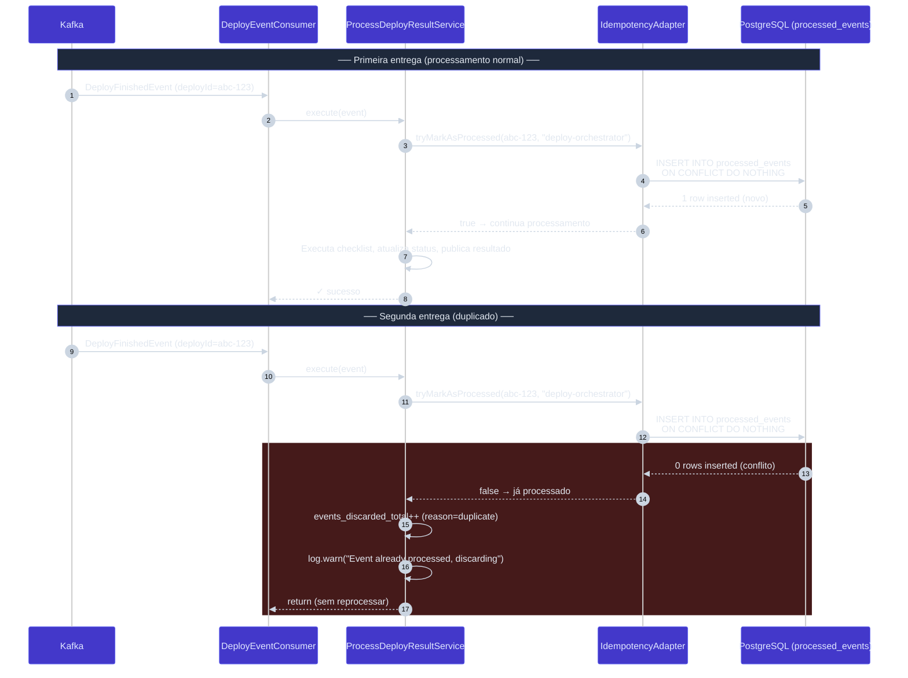
```mermaid
%%{init: {'theme':'dark', 'themeVariables':{'fontSize':'14px','actorTextColor':'#E0E7FF','actorBkg':'#4338CA','actorBorder':'#6366F1','activationBorderColor':'#6366F1','signalColor':'#CBD5E1','signalTextColor':'#E2E8F0','noteBkgColor':'#1E293B','noteBorderColor':'#6366F1','noteTextColor':'#E2E8F0','altSectionBkgColor':'#0F172A','labelTextColor':'#A5B4FC'}}}%%
sequenceDiagram
    autonumber
    participant K as Kafka
    participant DEC as DeployEventConsumer
    participant SVC as ProcessDeployResultService
    participant IDP as IdempotencyAdapter
    participant DB as PostgreSQL (processed_events)

    Note over K,DB: ── Primeira entrega (processamento normal) ──
    K->>DEC: DeployFinishedEvent (deployId=abc-123)
    DEC->>SVC: execute(event)
    SVC->>IDP: tryMarkAsProcessed(abc-123, "deploy-orchestrator")
    IDP->>DB: INSERT INTO processed_events<br/>ON CONFLICT DO NOTHING
    DB-->>IDP: 1 row inserted (novo)
    IDP-->>SVC: true → continua processamento
    SVC->>SVC: Executa checklist, atualiza status, publica resultado
    SVC-->>DEC: ✓ sucesso

    Note over K,DB: ── Segunda entrega (duplicado) ──
    K->>DEC: DeployFinishedEvent (deployId=abc-123)
    DEC->>SVC: execute(event)
    SVC->>IDP: tryMarkAsProcessed(abc-123, "deploy-orchestrator")
    IDP->>DB: INSERT INTO processed_events<br/>ON CONFLICT DO NOTHING

    rect rgb(69, 26, 26)
        DB-->>IDP: 0 rows inserted (conflito)
        IDP-->>SVC: false → já processado
        SVC->>SVC: events_discarded_total++ (reason=duplicate)
        SVC->>SVC: log.warn("Event already processed, discarding")
        SVC-->>DEC: return (sem reprocessar)
    end
```

<details>
<summary>Trechos de Código — Implementação de idempotência</summary>

**Nível 1 — Aplicação** (`ProcessDeployResultService.java`):

```java
if (!idempotencyPort.tryMarkAsProcessed(payload.deployId(), "deploy-orchestrator")) {
    eventsDiscardedCounter.increment();
    log.warn("Event already processed, discarding: deployId={}", payload.deployId());
    return;  // Retorno antecipado — nenhum efeito colateral
}
```

**Nível 2 — Banco de dados** (`ProcessedEventRepository.java`):

```java
@Modifying
@Query(value = "INSERT INTO processed_events (event_id, processed_at, service_name) " +
       "VALUES (:eventId, NOW(), :serviceName) " +
       "ON CONFLICT (event_id, service_name) DO NOTHING",
       nativeQuery = true)
int insertIfAbsent(@Param("eventId") UUID eventId, @Param("serviceName") String serviceName);
```

**Adapter** (`IdempotencyAdapter.java`):

```java
@Override
public boolean tryMarkAsProcessed(UUID eventId, String serviceName) {
    int inserted = repository.insertIfAbsent(eventId, serviceName);
    return inserted != 0;  // true = novo, false = duplicado
}
```

**Schema SQL** — tabela `processed_events`:

```sql
CREATE TABLE processed_events (
    event_id        UUID          NOT NULL,
    processed_at    TIMESTAMPTZ   NOT NULL DEFAULT NOW(),
    service_name    VARCHAR(100)  NOT NULL,
    PRIMARY KEY (event_id, service_name)
);
```

</details>

[← Voltar ao Índice](#índice)

---

## 9. Fluxo 2C — Retry e Dead Letter Topic (DLT)

Quando o processamento de um evento falha com uma exceção retentável (ex: `ChangeNotFoundException` por eventual consistency), o Spring Kafka executa até 4 tentativas com backoff exponencial antes de encaminhar para o DLT.

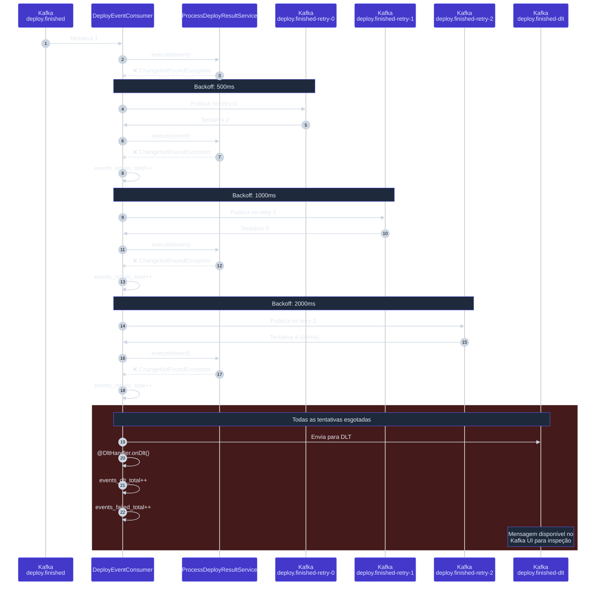
```mermaid
%%{init: {'theme':'dark', 'themeVariables':{'fontSize':'14px','actorTextColor':'#E0E7FF','actorBkg':'#4338CA','actorBorder':'#6366F1','activationBorderColor':'#6366F1','signalColor':'#CBD5E1','signalTextColor':'#E2E8F0','noteBkgColor':'#1E293B','noteBorderColor':'#6366F1','noteTextColor':'#E2E8F0','altSectionBkgColor':'#0F172A','labelTextColor':'#A5B4FC'}}}%%
sequenceDiagram
    autonumber
    participant K1 as Kafka<br/>deploy.finished
    participant DEC as DeployEventConsumer
    participant SVC as ProcessDeployResultService
    participant R0 as Kafka<br/>deploy.finished-retry-0
    participant R1 as Kafka<br/>deploy.finished-retry-1
    participant R2 as Kafka<br/>deploy.finished-retry-2
    participant DLT as Kafka<br/>deploy.finished-dlt

    K1->>DEC: Tentativa 1
    DEC->>SVC: execute(event)
    SVC--xDEC: ❌ ChangeNotFoundException

    Note over DEC,R0: Backoff: 500ms
    DEC->>R0: Publica no retry-0
    R0->>DEC: Tentativa 2
    DEC->>SVC: execute(event)
    SVC--xDEC: ❌ ChangeNotFoundException
    DEC->>DEC: events_retries_total++

    Note over DEC,R1: Backoff: 1000ms
    DEC->>R1: Publica no retry-1
    R1->>DEC: Tentativa 3
    DEC->>SVC: execute(event)
    SVC--xDEC: ❌ ChangeNotFoundException
    DEC->>DEC: events_retries_total++

    Note over DEC,R2: Backoff: 2000ms
    DEC->>R2: Publica no retry-2
    R2->>DEC: Tentativa 4 (última)
    DEC->>SVC: execute(event)
    SVC--xDEC: ❌ ChangeNotFoundException
    DEC->>DEC: events_retries_total++

    rect rgb(69, 26, 26)
        Note over DEC,DLT: Todas as tentativas esgotadas
        DEC->>DLT: Envia para DLT
        DEC->>DEC: @DltHandler.onDlt()
        DEC->>DEC: events_dlt_total++
        DEC->>DEC: events_failed_total++
        Note over DLT: Mensagem disponível no<br/>Kafka UI para inspeção
    end
```

### Configuração de Retry

| Parâmetro | Valor | Descrição |
|-----------|-------|-----------|
| `attempts` | 4 | Total de tentativas (1 original + 3 retries) |
| `delay` | 500ms | Delay inicial |
| `multiplier` | 2.0 | Fator exponencial (500 → 1000 → 2000 → 4000ms) |
| `maxDelay` | 10s | Teto de delay |
| `exclude` | `InvalidOrchestratorStateException` | Exceções que vão direto para DLT |

<details>
<summary>Trechos de Código — @RetryableTopic, @DltHandler</summary>

**`@RetryableTopic`** — configuração na annotation:

```java
@RetryableTopic(
        attempts = "4",
        backoff = @Backoff(delay = 500, multiplier = 2.0, maxDelay = 10_000),
        autoCreateTopics = "true",
        topicSuffixingStrategy = TopicSuffixingStrategy.SUFFIX_WITH_INDEX_VALUE,
        dltStrategy = DltStrategy.FAIL_ON_ERROR,
        dltTopicSuffix = "-dlt",
        exclude = {InvalidOrchestratorStateException.class}
)
```

**`@DltHandler`** — tratamento do Dead Letter:

```java
@DltHandler
public void onDlt(ConsumerRecord<String, Object> record) {
    String safePayload = toSafePayload(record.value());  // Trunca em 500 bytes
    log.error("Event routed to DLT: key={}, topic={}, offset={}, payload={}",
            record.key(), record.topic(), record.offset(), safePayload);
    dltCounter.increment();
    eventsFailedCounter.increment();
}
```

</details>

[← Voltar ao Índice](#índice)

---

## 10. Fluxo 2D — Poison Pill (Erro de Deserialização)

Uma mensagem malformada (JSON inválido, tipo incompatível) resulta em payload `null` após deserialização. O consumer detecta e lança `InvalidOrchestratorStateException`, que é excluída do retry — vai direto para o DLT.

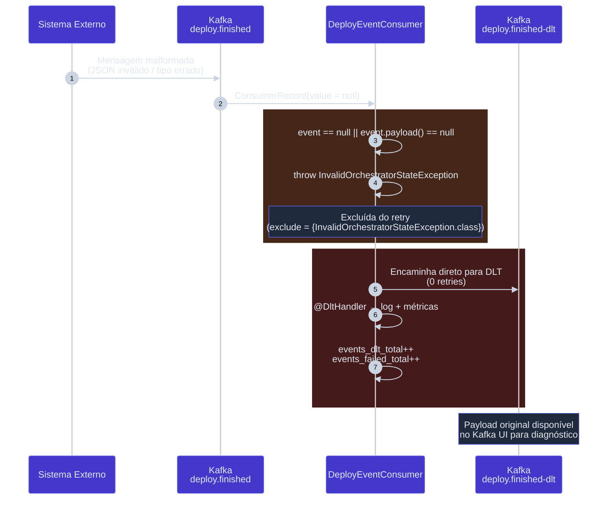
```mermaid
%%{init: {'theme':'dark', 'themeVariables':{'fontSize':'14px','actorTextColor':'#E0E7FF','actorBkg':'#4338CA','actorBorder':'#6366F1','activationBorderColor':'#6366F1','signalColor':'#CBD5E1','signalTextColor':'#E2E8F0','noteBkgColor':'#1E293B','noteBorderColor':'#6366F1','noteTextColor':'#E2E8F0','altSectionBkgColor':'#0F172A','labelTextColor':'#A5B4FC'}}}%%
sequenceDiagram
    autonumber
    participant Ext as Sistema Externo
    participant K as Kafka<br/>deploy.finished
    participant DEC as DeployEventConsumer
    participant DLT as Kafka<br/>deploy.finished-dlt

    Ext->>K: Mensagem malformada<br/>(JSON inválido / tipo errado)
    K->>DEC: ConsumerRecord(value = null)

    rect rgb(69, 39, 26)
        DEC->>DEC: event == null || event.payload() == null
        DEC->>DEC: throw InvalidOrchestratorStateException
        Note over DEC: Excluída do retry<br/>(exclude = {InvalidOrchestratorStateException.class})
    end

    rect rgb(69, 26, 26)
        DEC->>DLT: Encaminha direto para DLT<br/>(0 retries)
        DEC->>DEC: @DltHandler → log + métricas
        DEC->>DEC: events_dlt_total++<br/>events_failed_total++
    end

    Note over DLT: Payload original disponível<br/>no Kafka UI para diagnóstico
```

<details>
<summary>Trecho de Código — DeployEventConsumer, InvalidOrchestratorStateException</summary>

**Validação no consumer** (`DeployEventConsumer.java`):

```java
public void onDeployFinished(ConsumerRecord<String, DeployFinishedEvent> record, ...) {
    DeployFinishedEvent event = record.value();

    if (event == null || event.payload() == null) {
        log.error("Deserialization failed or invalid payload — sending to DLT: "
                + "topic={}, offset={}, key={}", topic, offset, record.key());
        throw new InvalidOrchestratorStateException(
                "Deserialization failed or invalid payload. topic=" + topic);
    }

    DeployFinishedEvent.Payload payload = event.payload();
    if (payload.deployId() == null || payload.changeId() == null || payload.result() == null) {
        log.error("Malformed payload: required fields must not be null — routing to DLT");
        throw new InvalidOrchestratorStateException(
                "Malformed DeployFinishedEvent: required payload fields are null");
    }
    // ... processamento normal
}
```

**Exceção não-retentável** (`InvalidOrchestratorStateException.java`):

```java
public class InvalidOrchestratorStateException extends RuntimeException {
    public InvalidOrchestratorStateException(String message) {
        super(message);
    }
}
```

</details>

[← Voltar ao Índice](#índice)

---

## 11. Fluxo 2E — Falha na Publicação → DLQ

Quando o `deploy-orchestrator` processa com sucesso o evento de deploy mas falha ao publicar o resultado no Kafka (timeout, broker indisponível), a mensagem é encaminhada para o tópico DLQ.

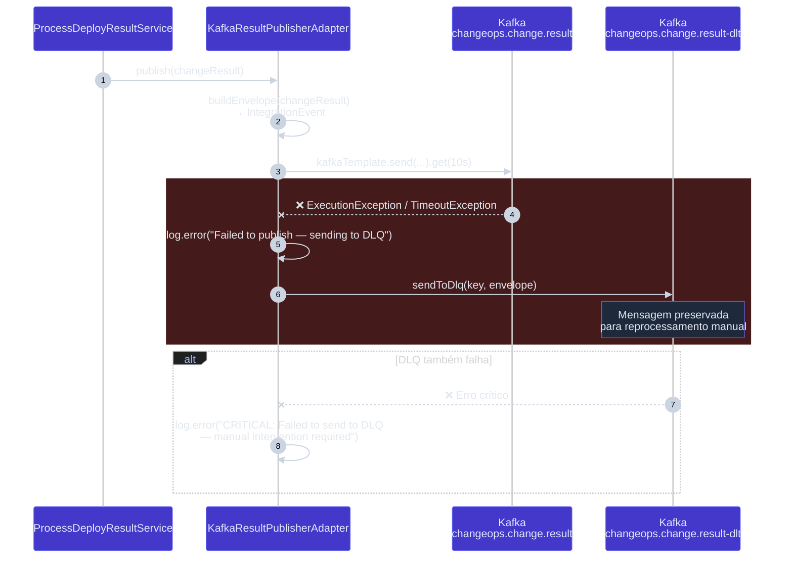
```mermaid
%%{init: {'theme':'dark', 'themeVariables':{'fontSize':'14px','actorTextColor':'#E0E7FF','actorBkg':'#4338CA','actorBorder':'#6366F1','activationBorderColor':'#6366F1','signalColor':'#CBD5E1','signalTextColor':'#E2E8F0','noteBkgColor':'#1E293B','noteBorderColor':'#6366F1','noteTextColor':'#E2E8F0','altSectionBkgColor':'#0F172A','labelTextColor':'#A5B4FC'}}}%%
sequenceDiagram
    autonumber
    participant SVC as ProcessDeployResultService
    participant KP as KafkaResultPublisherAdapter
    participant K1 as Kafka<br/>changeops.change.result
    participant DLQ as Kafka<br/>changeops.change.result-dlt

    SVC->>KP: publish(changeResult)
    KP->>KP: buildEnvelope(changeResult)<br/>→ IntegrationEvent
    KP->>K1: kafkaTemplate.send(...).get(10s)

    rect rgb(69, 26, 26)
        K1--xKP: ❌ ExecutionException / TimeoutException
        KP->>KP: log.error("Failed to publish — sending to DLQ")
        KP->>DLQ: sendToDlq(key, envelope)
        Note over DLQ: Mensagem preservada<br/>para reprocessamento manual
    end

    alt DLQ também falha
        DLQ--xKP: ❌ Erro crítico
        KP->>KP: log.error("CRITICAL: Failed to send to DLQ<br/>— manual intervention required")
    end
```

<details>
<summary>Trecho de Código — KafkaResultPublisherAdapter</summary>

**`KafkaResultPublisherAdapter.java`** — publicação com fallback para DLQ:

```java
@Override
public void publish(ChangeResult result) {
    String key = result.getChangeId().toString();
    IntegrationEvent envelope = buildEnvelope(result);
    try {
        kafkaTemplate.send(changeResultTopic, key, envelope)
                     .get(10, TimeUnit.SECONDS);
        getOrCreateCounter(envelope.eventType()).increment();
    } catch (ExecutionException | TimeoutException e) {
        log.error("Failed to publish — sending to DLQ: changeId={}", result.getChangeId());
        sendToDlq(key, envelope);
    } catch (InterruptedException e) {
        Thread.currentThread().interrupt();
        sendToDlq(key, envelope);
    }
}

private void sendToDlq(String key, IntegrationEvent envelope) {
    kafkaTemplate.send(dlqTopic, key, envelope)
        .whenComplete((r, ex) -> {
            if (ex != null) {
                log.error("CRITICAL: Failed to send to DLQ — manual intervention required");
            }
        });
}
```

</details>

[← Voltar ao Índice](#índice)

---

## 12. Observabilidade — Métricas e Dashboards

Ambos os serviços expõem métricas via Micrometer no endpoint `/actuator/prometheus`. O Prometheus coleta a cada 5 segundos e o Grafana exibe em dashboards pré-provisionados.

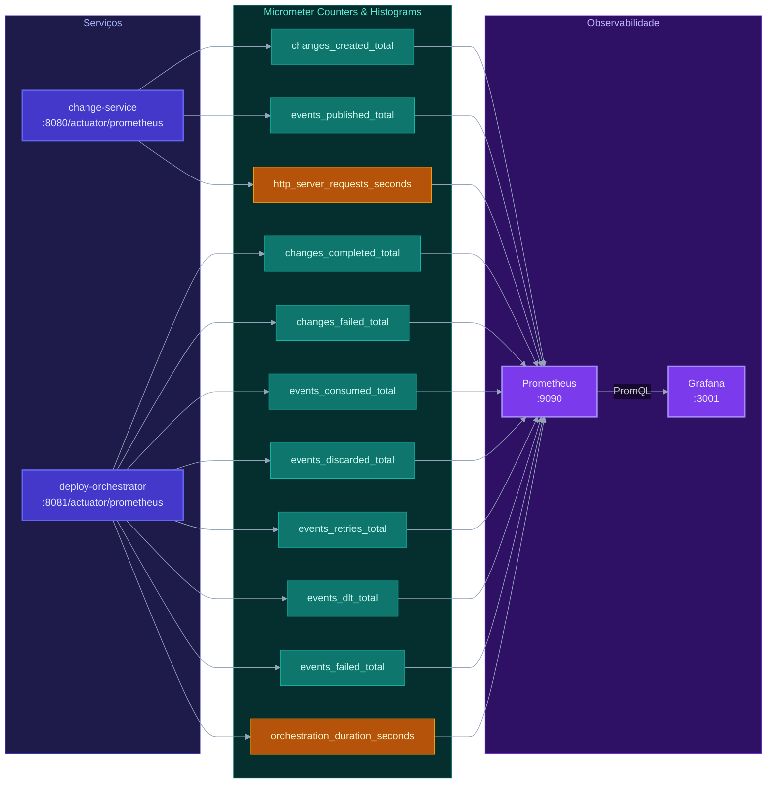
```mermaid
%%{init: {'theme':'dark', 'themeVariables':{'fontSize':'15px','lineColor':'#94A3B8','edgeLabelBackground':'transparent'}}}%%
flowchart LR
    subgraph services["Serviços"]
        direction TB
        CS["change-service<br/>:8080/actuator/prometheus"]
        DO["deploy-orchestrator<br/>:8081/actuator/prometheus"]
    end

    subgraph metrics["Micrometer Counters & Histograms"]
        direction TB
        C1["changes_created_total"]
        C2["changes_completed_total"]
        C3["changes_failed_total"]
        C4["events_published_total"]
        C5["events_consumed_total"]
        C6["events_discarded_total"]
        C7["events_retries_total"]
        C8["events_dlt_total"]
        C9["events_failed_total"]
        H1["orchestration_duration_seconds"]
        H2["http_server_requests_seconds"]
    end

    subgraph observability["Observabilidade"]
        direction TB
        PROM["Prometheus<br/>:9090"]
        GRAF["Grafana<br/>:3001"]
    end

    CS --> C1 & C4 & H2
    DO --> C2 & C3 & C5 & C6 & C7 & C8 & C9 & H1
    C1 & C2 & C3 & C4 & C5 & C6 & C7 & C8 & C9 & H1 & H2 --> PROM
    PROM -->|PromQL| GRAF

    classDef svc fill:#4338CA,stroke:#6366F1,color:#E0E7FF,stroke-width:2px
    classDef metric fill:#0F766E,stroke:#14B8A6,color:#CCFBF1,stroke-width:1px
    classDef hist fill:#B45309,stroke:#F59E0B,color:#FEF3C7,stroke-width:1px
    classDef monitoring fill:#7C3AED,stroke:#A78BFA,color:#EDE9FE,stroke-width:2px

    class CS,DO svc
    class C1,C2,C3,C4,C5,C6,C7,C8,C9 metric
    class H1,H2 hist
    class PROM,GRAF monitoring

    style services fill:#1E1B4B,stroke:#4338CA,stroke-width:1px,color:#A5B4FC
    style metrics fill:#042F2E,stroke:#0F766E,stroke-width:1px,color:#5EEAD4
    style observability fill:#2E1065,stroke:#7C3AED,stroke-width:1px,color:#C4B5FD
```

### Tabela de Métricas

| Métrica | Tipo | Serviço | Descrição |
|---------|------|---------|-----------|
| `changes_created_total` | Counter | change-service | Total de changes criadas |
| `changes_completed_total` | Counter | deploy-orchestrator | Changes transicionadas para COMPLETED |
| `changes_failed_total` | Counter | deploy-orchestrator | Changes transicionadas para FAILED |
| `events_published_total{type}` | Counter | ambos | Eventos publicados por tipo |
| `events_consumed_total{type}` | Counter | deploy-orchestrator | Eventos consumidos por tipo |
| `events_discarded_total{reason}` | Counter | deploy-orchestrator | Eventos descartados (duplicados) |
| `events_retries_total` | Counter | deploy-orchestrator | Total de hops de retry |
| `events_dlt_total` | Counter | deploy-orchestrator | Eventos encaminhados para DLT |
| `events_failed_total` | Counter | deploy-orchestrator | Eventos que falharam permanentemente |
| `timeline_persistence_failures_total` | Counter | change-service | Falhas na persistência da timeline |
| `orchestration_duration_seconds` | Histogram | deploy-orchestrator | Latência ponta a ponta do processamento |
| `http_server_requests_seconds` | Histogram | change-service | Latência de requisições REST |

### Painéis Grafana (dashboard `changeops.json`)

| Linha | Painéis | Tipo |
|-------|---------|------|
| **Changes** | Created (total) · Completed · Failed · Prepared · By Status (pie) · API Latency p95 | stat + piechart + timeseries |
| **Events** | Published · Consumed · Failed · Retries · DLT · Discarded · Rate per min | stat + timeseries |
| **Orchestration** | Orchestration Latency p95 | timeseries |
| **Kafka** | Listener Latency p95 · Producer Latency p95 | timeseries |

**Acesso:** http://localhost:3001 (admin / admin)

[← Voltar ao Índice](#índice)

---

## 13. Observabilidade — Logs e Correlation ID

Todos os logs são estruturados em JSON via `logstash-logback-encoder`. O `correlation_id` é propagado automaticamente por toda a cadeia — do HTTP header ao MDC, passando pelo Kafka e chegando aos logs do `deploy-orchestrator`.

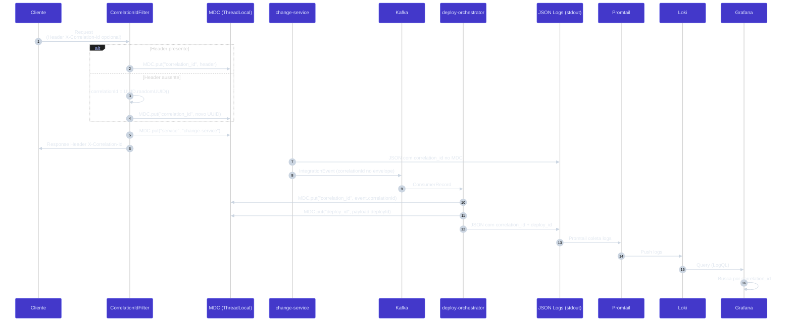
```mermaid
%%{init: {'theme':'dark', 'themeVariables':{'fontSize':'14px','actorTextColor':'#E0E7FF','actorBkg':'#4338CA','actorBorder':'#6366F1','activationBorderColor':'#6366F1','signalColor':'#CBD5E1','signalTextColor':'#E2E8F0','noteBkgColor':'#1E293B','noteBorderColor':'#6366F1','noteTextColor':'#E2E8F0','altSectionBkgColor':'#0F172A','labelTextColor':'#A5B4FC'}}}%%
sequenceDiagram
    autonumber
    participant Client as Cliente
    participant CIF as CorrelationIdFilter
    participant MDC as MDC (ThreadLocal)
    participant CS as change-service
    participant Kafka as Kafka
    participant DO as deploy-orchestrator
    participant LOG as JSON Logs (stdout)
    participant PT as Promtail
    participant Loki as Loki
    participant Graf as Grafana

    Client->>CIF: Request<br/>(Header X-Correlation-Id opcional)

    alt Header presente
        CIF->>MDC: MDC.put("correlation_id", header)
    else Header ausente
        CIF->>CIF: correlationId = UUID.randomUUID()
        CIF->>MDC: MDC.put("correlation_id", novo UUID)
    end

    CIF->>MDC: MDC.put("service", "change-service")
    CIF->>Client: Response Header X-Correlation-Id

    CS->>LOG: JSON com correlation_id no MDC
    CS->>Kafka: IntegrationEvent (correlationId no envelope)

    Kafka->>DO: ConsumerRecord
    DO->>MDC: MDC.put("correlation_id", event.correlationId)
    DO->>MDC: MDC.put("deploy_id", payload.deployId)
    DO->>LOG: JSON com correlation_id + deploy_id

    LOG->>PT: Promtail coleta logs
    PT->>Loki: Push logs
    Loki->>Graf: Query (LogQL)
    Graf->>Graf: Busca por correlation_id
```

### Formato do Log (JSON estruturado)

```json
{
  "timestamp": "2026-03-30T15:02:38.142Z",
  "level": "INFO",
  "service": "change-service",
  "correlation_id": "a1b2c3d4-e5f6-7890-abcd-ef1234567890",
  "change_id": "f47ac10b-58cc-4372-a567-0e02b2c3d479",
  "message": "Change created: changeId=f47ac10b, correlationId=a1b2c3d4, status=PREPARED",
  "logger_name": "c.c.c.a.s.CreateChangeService",
  "thread_name": "http-nio-8080-exec-1"
}
```

### Campos MDC Obrigatórios

| Campo | Serviço | Origem |
|-------|---------|--------|
| `correlation_id` | ambos | `CorrelationIdFilter` (change-service) / campo do `IntegrationEvent` (deploy-orchestrator) |
| `service` | ambos | Fixo: `"change-service"` ou `"deploy-orchestrator"` |
| `change_id` | ambos | UUID da change (quando disponível) |
| `deploy_id` | deploy-orchestrator | UUID do deploy (Flow 2 apenas) |

<details>
<summary>Trecho de Código — CorrelationIdFilter, ProcessDeployResultService MDC</summary>

**`CorrelationIdFilter.java`** — gera UUID e popula MDC:

```java
@Override
public void doFilter(ServletRequest request, ServletResponse response, FilterChain chain)
        throws IOException, ServletException {
    HttpServletRequest httpRequest = (HttpServletRequest) request;
    String correlationId = httpRequest.getHeader("X-Correlation-Id");
    if (correlationId == null || correlationId.isBlank()) {
        correlationId = UUID.randomUUID().toString();
    }
    MDC.put("correlation_id", correlationId);
    MDC.put("service", "change-service");
    ((HttpServletResponse) response).setHeader("X-Correlation-Id", correlationId);
    try {
        chain.doFilter(request, response);
    } finally {
        MDC.clear();
    }
}
```

**MDC no deploy-orchestrator** (`ProcessDeployResultService.java`):

```java
MDC.put("correlation_id", event.correlationId().toString());
MDC.put("change_id", payload.changeId().toString());
MDC.put("deploy_id", payload.deployId().toString());
```

</details>

[← Voltar ao Índice](#índice)

---

## 14. Tópicos Kafka e Contratos

Mapa completo de tópicos, produtores, consumidores e o formato do envelope `IntegrationEvent`.

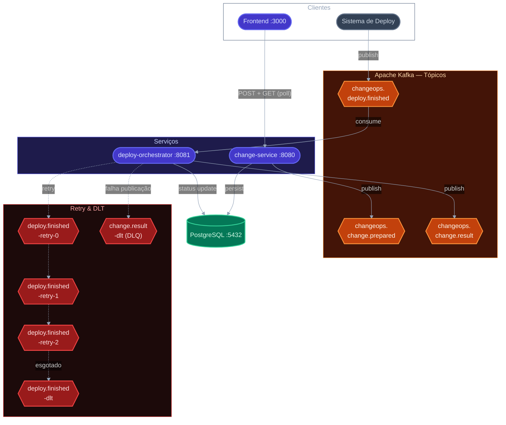
```mermaid
%%{init: {'theme':'dark','themeVariables':{'fontSize':'15px','lineColor':'#94A3B8','edgeLabelBackground':'transparent'}}}%%
flowchart TD
    subgraph clients["Clientes"]
        direction LR
        FE(["Frontend :3000"])
        DS(["Sistema de Deploy"])
    end

    subgraph svcs["Serviços"]
        direction LR
        CS(["change-service :8080"])
        DO(["deploy-orchestrator :8081"])
    end

    subgraph kafka["Apache Kafka — Tópicos"]
        direction LR
        T1{{"changeops.<br/>change.prepared"}}
        T2{{"changeops.<br/>deploy.finished"}}
        T3{{"changeops.<br/>change.result"}}
    end

    subgraph retry["Retry & DLT"]
        direction LR
        R0{{"deploy.finished<br/>-retry-0"}}
        R1{{"deploy.finished<br/>-retry-1"}}
        R2{{"deploy.finished<br/>-retry-2"}}
        DLT{{"deploy.finished<br/>-dlt"}}
        DLQ{{"change.result<br/>-dlt (DLQ)"}}
    end

    PG[("PostgreSQL :5432")]

    FE -->|"POST + GET (poll)"| CS
    CS -->|"persist"| PG
    CS -->|"publish"| T1
    DS -->|"publish"| T2
    T2 -->|"consume"| DO
    DO -->|"status update"| PG
    DO -->|"publish"| T3
    DO -.->|"retry"| R0
    R0 -.-> R1
    R1 -.-> R2
    R2 -.->|"esgotado"| DLT
    DO -.->|"falha publicação"| DLQ

    classDef svc fill:#4338CA,stroke:#6366F1,color:#E0E7FF,stroke-width:2px
    classDef topic fill:#C2410C,stroke:#FB923C,color:#FFF7ED,stroke-width:2px
    classDef db fill:#047857,stroke:#34D399,color:#D1FAE5,stroke-width:2px
    classDef ext fill:#334155,stroke:#64748B,color:#CBD5E1,stroke-width:2px
    classDef dlt fill:#991B1B,stroke:#EF4444,color:#FEE2E2,stroke-width:2px

    class FE,CS,DO svc
    class T1,T2,T3 topic
    class R0,R1,R2,DLT,DLQ dlt
    class PG db
    class DS ext

    style clients fill:none,stroke:#64748B,stroke-width:1px,color:#94A3B8
    style svcs fill:#1E1B4B,stroke:#6366F1,stroke-width:1px,color:#C7D2FE
    style kafka fill:#431407,stroke:#FB923C,stroke-width:1px,color:#FED7AA
    style retry fill:#1C0A0A,stroke:#EF4444,stroke-width:1px,color:#FCA5A5
```

### Envelope `IntegrationEvent`

Todos os eventos publicados no Kafka seguem a mesma estrutura de envelope. O evento de domínio nunca é publicado diretamente — sempre é envelopado com metadados de rastreabilidade e versionamento.

```json
{
  "eventType": "ChangePreparedEvent",
  "version": "1.0",
  "correlationId": "a1b2c3d4-e5f6-7890-abcd-ef1234567890",
  "occurredAt": "2026-03-30T15:02:38.142Z",
  "payload": {
    "changeId": "f47ac10b-58cc-4372-a567-0e02b2c3d479",
    "componentId": "payment-service",
    "requestedBy": "dev-user-001",
    "scheduledAt": "2026-04-01T10:00:00Z"
  }
}
```

<details>
<summary>Código — IntegrationEvent.java</summary>

**Record Java** (`IntegrationEvent.java`):

```java
@Builder
public record IntegrationEvent(
        String eventType,       // "ChangePreparedEvent", "ChangeCompletedEvent", "ChangeFailedEvent"
        String version,         // "1.0" — versionamento para compatibilidade
        UUID correlationId,     // Rastreabilidade ponta a ponta
        Instant occurredAt,     // Timestamp do envio
        Object payload          // Payload específico do evento de domínio
) {}
```

</details>

### Mapa de Tópicos

| Tópico | Produtor | Consumidor | Payload |
|--------|----------|------------|---------|
| `changeops.change.prepared` | change-service | — (futuro) | `ChangePreparedEvent` |
| `changeops.deploy.finished` | Sistema externo | deploy-orchestrator | `DeployFinishedEvent` |
| `changeops.change.result` | deploy-orchestrator | — (futuro) | `ChangeCompletedEvent` / `ChangeFailedEvent` |
| `changeops.deploy.finished-retry-{0,1,2}` | Spring Kafka (auto) | deploy-orchestrator | Retry automático (0-based index) |
| `changeops.deploy.finished-dlt` | Spring Kafka (auto) | `@DltHandler` | Dead Letter — falhas permanentes |
| `changeops.change.result-dlt` | deploy-orchestrator | — (manual) | DLQ — falha na publicação do resultado |

### Schema do Banco de Dados

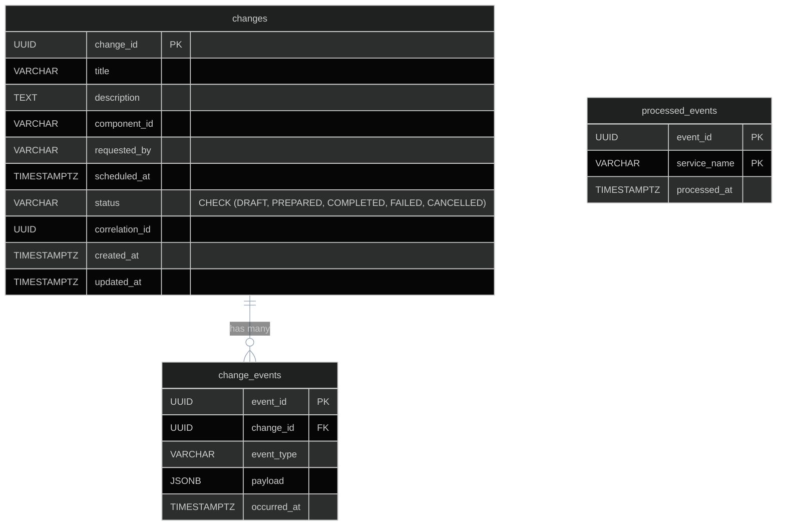
```mermaid
%%{init: {'theme':'dark','themeVariables':{'fontSize':'14px','lineColor':'#94A3B8'}}}%%
erDiagram
    changes ||--o{ change_events : "has many"
    changes {
        UUID change_id PK
        VARCHAR title
        TEXT description
        VARCHAR component_id
        VARCHAR requested_by
        TIMESTAMPTZ scheduled_at
        VARCHAR status "CHECK (DRAFT, PREPARED, COMPLETED, FAILED, CANCELLED)"
        UUID correlation_id
        TIMESTAMPTZ created_at
        TIMESTAMPTZ updated_at
    }
    change_events {
        UUID event_id PK
        UUID change_id FK
        VARCHAR event_type
        JSONB payload
        TIMESTAMPTZ occurred_at
    }
    processed_events {
        UUID event_id PK
        VARCHAR service_name PK
        TIMESTAMPTZ processed_at
    }
```

[← Voltar ao Índice](#índice)

---

> **Fim da apresentação guiada.** Para mais detalhes sobre decisões arquiteturais, consulte os [ADRs](../adr/) (ADR-001 a ADR-007). Para o escopo completo do projeto, veja o [PROJETO_COMPLETO.md](../PROJETO_COMPLETO.md).
