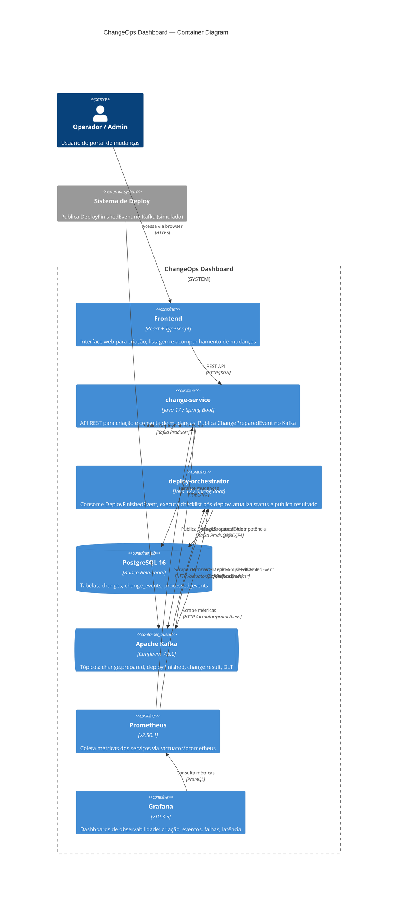

# Diagrama C4 — Container

Visão de containers do ChangeOps Dashboard.

## Descrição dos Containers

| Container | Responsabilidade |
|-----------|-----------------|
| **Frontend** | Interface React com formulário de criação, listagem paginada, polling a cada 5s e timeline de eventos |
| **change-service** | API REST (`POST/GET /api/v1/changes`), validação de domínio, persistência, publicação de evento de domínio encapsulado em envelope de integração |
| **deploy-orchestrator** | Consumer Kafka com idempotência via `processed_events`, checklist pós-deploy, atualização de status, publicação de evento de resultado, retry com backoff + DLQ |
| **PostgreSQL** | Banco compartilhado com schema único: `changes`, `change_events`, `processed_events`. Flyway migrations independentes por serviço |
| **Kafka** | Broker de eventos com 3 tópicos principais + DLT. Produtor idempotente, consumer groups com ACK por registro |
| **Prometheus** | Scraper de métricas HTTP a cada 15s. Coleta: `changes_created_total`, `events_published_total`, `events_consumed_total`, `events_failed_total` |
| **Grafana** | 7 painéis: counters de criação/publicação/consumo/falha, latência p95, distribuição por status, taxa de eventos |
