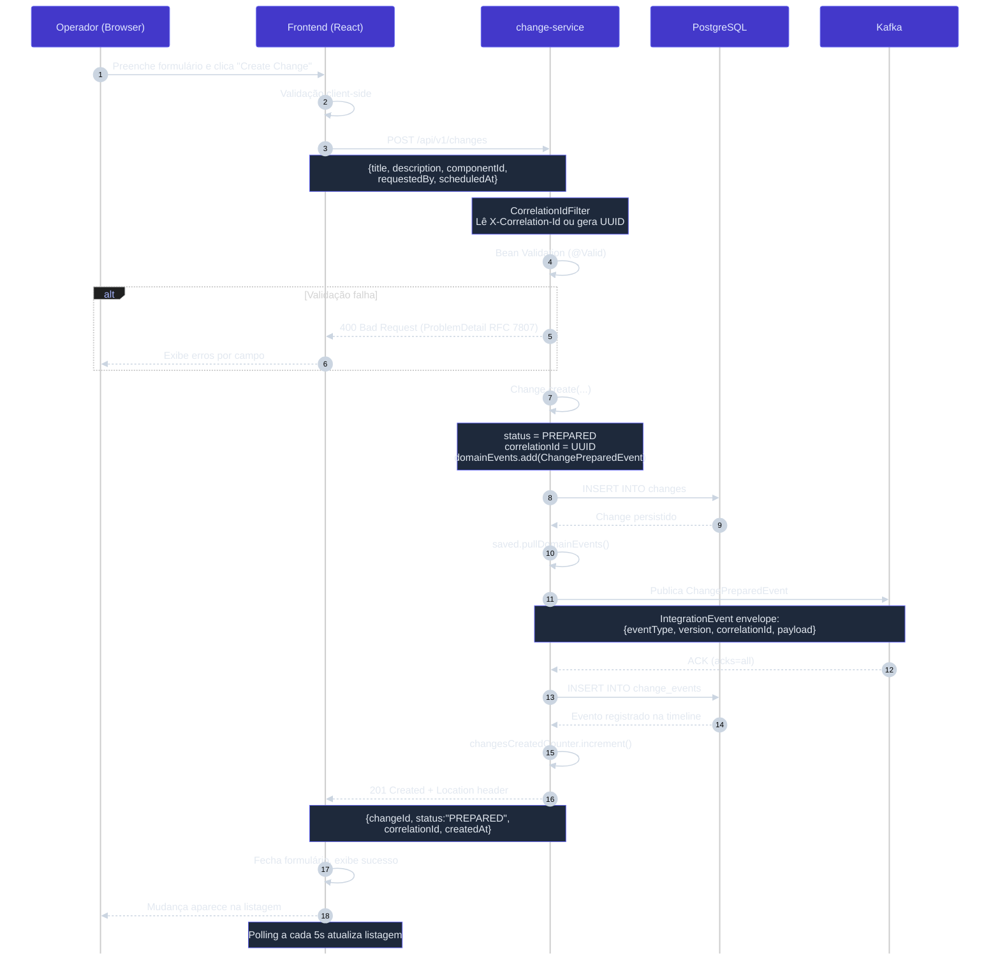

# Diagrama de Sequência — Fluxo 1: Criação de Mudança

## Detalhes do Fluxo

1. **Validação em duas camadas:** client-side (HTML5 + JS) e server-side (Bean Validation + domínio).
2. **Status direto:** `Change.create()` define status como `PREPARED` (não passa por `DRAFT` — ver [ADR-005](../adr/ADR-005-estrutura-pacotes.md)).
3. **Evento de domínio → integração:** `ChangePreparedEvent` é encapsulado em `IntegrationEvent` pelo adapter Kafka antes da publicação.
4. **Transacionalidade:** `@Transactional` no `CreateChangeService.execute()` — DB commit + Kafka publish na mesma transação lógica (gap: sem Outbox — ver Roadmap Phase 2.1).
5. **Observabilidade:** `correlation_id` no MDC desde o filtro HTTP, presente em todos os logs e no evento publicado.
