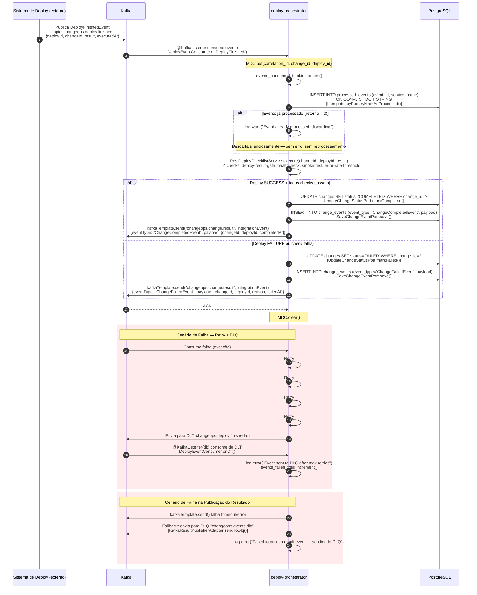

# Diagrama de Sequência — Fluxo 2: Orquestração de Deploy

## Detalhes do Fluxo

1. **Idempotência atômica:** `INSERT ... ON CONFLICT DO NOTHING` retorna 1 (primeiro processamento) ou 0 (duplicata). Sem race conditions.
2. **Checklist pós-deploy:** 4 verificações simuladas. Se qualquer check falha, o status é `FAILED` com reason detalhado.
3. **Retry com backoff exponencial:** 4 tentativas com delays de 500ms → 1s → 2s → 4s (max 10s). Configurado via `@RetryableTopic`.
4. **Dois caminhos de DLQ:**
   - **Consumo:** `@RetryableTopic` com DLT suffix — tópico `changeops.deploy.finished-dlt`.
   - **Publicação:** Fallback no adapter — tópico `changeops.events.dlq`.
5. **Observabilidade:** MDC com `correlation_id`, `change_id`, `deploy_id` em todos os logs do fluxo. Métricas: `events_consumed_total`, `events_published_total`, `events_failed_total`.
